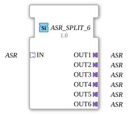

# ASR_SPLIT_6

* * * * * * * * * *
## Introduction
The function block `ASR_SPLIT_6` distributes an incoming ASR signal (Generic Adapter Type) to six identical ASR outputs. It serves as a pure signal splitter and is provided as a generic function block in the 4diac IDE.
## Interface Structure

### **Event Inputs**
None.

### **Event Outputs**
None.

### **Data Inputs**
None.

### **Data Outputs**
None.

### **Adapters**

| Adapter | Direction | Type | Description |
|---------|----------|-----|--------------|
| `IN` | Socket | `adapter::types::unidirectional::ASR` | Input adapter – the ASR signal to be distributed |
| `OUT1` – `OUT6` | Plug | `adapter::types::unidirectional::ASR` | Six output adapters – identical copies of the input signal |

## Functionality

This component does not perform any data processing or state logic. It forwards the adapter (unidirectional ASR) connected to socket `IN` directly and without delay to all six plugs (`OUT1` to `OUT6`). Thus, the same signal is present at each output as at the input. The distribution occurs purely at the adapter level, without the involvement of events or data inputs/outputs.

## Technical Features
- **Generic Function Block**: The function block uses the generic type definition `GEN_ASR_SPLIT` (attribute `eclipse4diac::core::GenericClassName`). This allows for flexible reuse with different ASR adapter types.
- **Unidirectional Adapter**: Both the input and outputs are of type `adapter::types::unidirectional::ASR`, meaning the data flows only in one direction (from the socket to the plugs).
- **No State Logic**: The component has no ECC (Execution Control Chart) and no internal states – it is a pure connection without any temporal behavior.
- **Scalability**: Due to the generic concept, similar splitters with any number of outputs (e.g., 2, 4, 8) can be created.

## State Overview

There is no state diagram (ECC) because the component does not execute any sequential logic. Signal distribution is static and continuous.

## Application Scenarios
- **Distribution of a sensor signal** to multiple control units or subsystems.
- **Provision of the same ASR communication channel** for parallel processing branches.
- **Test and simulation environments** where an input signal is required multiple times.

## Comparison with Similar Components

| Component | Outputs | Special Features |
|----------|----------|--------------|
| `ASR_SPLIT_2` | 2 | Dual Split |
| `ASR_SPLIT_4` | 4 | Quad Split |
| **`ASR_SPLIT_6`** | **6** | **Six-Way Split (this module)** |
| Generic Split (e.g., via template) | Variable | Requires individual parameterization |

The `ASR_SPLIT_6` offers a fixed number of six outputs and is therefore specifically designed for applications that require exactly this number.

## Conclusion

The `ASR_SPLIT_6` function block is a simple yet useful function block for signal duplication at the adapter level. Its generic nature and clear, uneventful operation make it ideal for modular control architectures that require multiple uses of an ASR signal.

---

### 🌐 Related topic subpages on ms-muc-docs.de
* [🌐 Eclipse 4diac IDE & color reference on ms-muc-docs.de ](https://www.ms-muc-docs.de/iec-61499/eclipse-4diac/)
