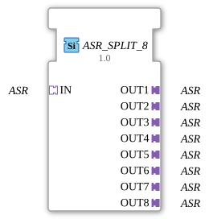

# ASR_SPLIT_8

*(Insert image of function block here)*

* * * * * * * * * *
## Introduction

The function block `ASR_SPLIT_8` is used to distribute a single incoming **ASR** adapter signal unchanged to eight identical outputs. It is defined as a generic function block and is particularly suitable for applications where a sensor or control signal is required multiple times – for example, in agricultural automation technology.

## Interface Structure

### **Event Inputs**

No event inputs are available. The function block operates purely on an adapter basis without event-driven execution.

#### **Event Outputs**

No event outputs are available.

#### **Data Inputs**

No data inputs are available. All signal transmissions take place via the **adapter** interfaces.

### **Data Outputs**

No data outputs available.

### **Adapters**

| Direction | Name | Type | Description |

|----------|-------|-------------------------------|---------------------------------------------------|

| Socket | IN | `adapter::types::unidirectional::ASR` | Incoming ASR signal distributed to all outputs. |

| Plug | OUT1 | `adapter::types::unidirectional::ASR` | First output with the signal from IN. |

| Plug | OUT2 | `adapter::types::unidirectional::ASR` | Second output with the signal from IN. |

| Plug | OUT3 | `adapter::types::unidirectional::ASR` | Third output with the signal from IN. |

| Plug | OUT4 | `adapter::types::unidirectional::ASR` | Fourth output with the signal from IN. |

| Plug | OUT5 | `adapter::types::unidirectional::ASR` | Fifth output with the signal from IN. |

| Plug | OUT6 | `adapter::types::unidirectional::ASR` | Sixth output with the signal from IN. |

| Plug | OUT7 | `adapter::types::unidirectional::ASR` | Seventh output with the signal from IN. |

| Plug | OUT8 | `adapter::types::unidirectional::ASR` | Eighth output with the signal from IN. |

## Functionality

The `ASR_SPLIT_8` block represents a **1-to-8 signal distribution** for the ASR adapter type. The ASR signal present at socket `IN` is forwarded to all eight plug outputs (`OUT1`...`OUT8`) without delay or state change. No signal conditioning, filtering, or logical processing takes place – the block operates purely passively and without any inherent behavior.

Since the adapter type `ASR` is defined as unidirectional, data flows only from the socket to the plugs. Changes to the input signal immediately affect all outputs.

## Technical Features

- **Generic Type Parameterization**: The function block (FB) has the attributes `eclipse4diac::core::GenericClassName` (value `'GEN_ASR_SPLIT'`) and `eclipse4diac::core::TypeHash`, which enable the use of a generic ASR data type. This allows the block to be reused for various ASR subtypes.

- **No Event Control**: The block contains no event inputs or outputs; signal transmission occurs exclusively via the adapter interfaces. This simplifies integration into static data flows.

- **No Internal Behavior**: There is no state machine or algorithm – functionality is limited to the pure wiring logic of the 4diac IDE.

## State Overview

The `ASR_SPLIT_8` has **no internal states**. The output is a direct function of the input signal at any given time. The block behaves like passive wiring (sterile splitter) without any memory or delay effects.

## Application Scenarios

- **Distribution of a sensor signal** (e.g., speed, pressure, or position) to multiple parallel control loops or display units.

- **Dividing a control command** to multiple actuators in an agricultural machine, such as the simultaneous control of several valves or drives.

- **Monitoring and Logging**: A signal can be routed to a controller via one output and to a diagnostic system via a second output.

## Comparison with Similar Blocks

| Block | Outputs | Special Features |

|------------------------|----------|------------------------------------------------|

| `ASR_SPLIT_8` | 8 | Provides the maximum possible number of ASR copies in one block. |

| `ASR_SPLIT_4` | 4 | More compact alternative for smaller distribution systems. |

| `ASR_SPLIT_2` | 2 | Minimal splitter for point-to-point transmission. |

The **8-way version** is the most comprehensive and allows the connection of many devices without additional cascading. Compared to cascading multiple 2-way or 4-way splitters, `ASR_SPLIT_8` reduces the number of required blocks and simplifies engineering.

## Conclusion

The `ASR_SPLIT_8` is a simple yet efficient component for distributing an ASR signal across eight independent paths. Its generic design and the absence of states and events make it robust, resource-efficient, and ideally suited for unidirectional data transmission in agricultural and industrial automation systems. It complements the ASR splitter family and addresses the need for a high number of parallel outputs.

---

### 🌐 Related topic subpages on ms-muc-docs.de

* [🌐 Eclipse 4diac IDE & Color Reference on ms-muc-docs.de](https://www.ms-muc-docs.de/iec-61499/eclipse-4diac/)

]