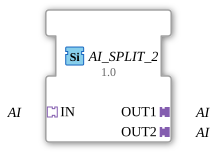

# AI_SPLIT_2

* * * * * * * * * *

## Introduction
The AI_SPLIT_2 function block is used to distribute an analog input signal (AI) to two identical analog outputs. It is designed as a generic function block and allows for flexible further processing of the signal in two independent paths.

## Interface Structure
The function block does not have event or data inputs/outputs in the traditional sense, but communicates exclusively via adapter interfaces of type `adapter::types::unidirectional::AI`.

### **Event Inputs**
None

### **Event Outputs**
None

### **Data Inputs**
None

### **Data Outputs**
None

### **Adapter**

| Adapter | Type | Direction | Description |

|---------|-----|----------|--------------|

| IN | adapter::types::unidirectional::AI | Input (Socket) | Receives an analog input signal. |

| OUT1 | adapter::types::unidirectional::AI | Output (Plug) | Passes the signal present at IN unchanged. |

| OUT2 | adapter::types::unidirectional::AI | Output (Plug) | Passes the signal present at IN unchanged. |

## Functionality
The module passes the analog signal (AI) received via socket `IN` simultaneously to both outputs (`OUT1` and `OUT2`). No signal processing or modification takes place. The partitioning is purely passive and takes effect immediately. The adapters ensure the necessary interface compatibility.

## Technical Features

- **Generic Structure**: The function block is implemented as a generic FB (`GEN_AI_SPLIT`) and can be used with various AI adapters that conform to the unidirectional AI protocol.

- **No State Logic**: There is no ECC (Execution Control Chart), therefore the behavior is purely combinatorial.

- **Platform Independence**: The function block is specified according to IEC 61499-2 and can be used in environments that support the adapter concept.

## State Overview

The function block has no internal state behavior. The outputs follow the input signal directly and without delay.

## Application Scenarios

- **Signal Distribution**: A single analog sensor (e.g., pressure sensor, temperature sensor) is to be evaluated by two independent control components.

- **Redundancy**: Splitting a signal for parallel monitoring and control paths.

- **Simulation**: Generating a second identical signal channel for testing or analysis purposes.

## Comparison with similar function blocks

- **AI_SPLIT_3**: Extended to three outputs.

- **AI_SELECT**: Selects one of several inputs instead of distributing them.

- **AI_MERGE**: Combines multiple AI signals into one (e.g., average).

AI_SPLIT_2 is specialized for simple 1:2 distribution without logic or configuration.

## Conclusion

AI_SPLIT_2 is a simple yet useful function block for passively splitting an analog input signal. Its generic adapter approach makes it flexible and facilitates the modular structuring of applications according to IEC 61499.