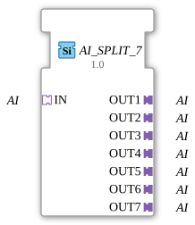

# AI_SPLIT_7

* * * * * * * * * *
## Introduction
The function block **AI_SPLIT_7** is used to distribute a single analog input (AI) to seven identical analog outputs. It is a generic function block that passes the incoming analog value unchanged to all seven output adapters. This allows multiple devices to be powered from a single signal source without having to acquire or duplicate the signal multiple times.
## Interface Structure
### **Event Inputs**
The function block has no event inputs. Data is passed exclusively via adapters.

### **Event Outputs**
There are no event outputs.

### **Data Inputs**
Direct data inputs are not defined. The analog value is read exclusively via the **IN** (socket) adapter.

### **Data Outputs**
Direct data outputs are not available. The analog values are output via the seven adapters **OUT1** to **OUT7** (plugs).

### **Adapters**
- **IN** (Socket): Type `adapter::types::unidirectional::AI` – Input for the analog signal.
- **OUT1** to **OUT7** (plugs): Type `adapter::types::unidirectional::AI` – Seven outputs that forward the incoming value identically.

## Functionality

**AI_SPLIT_7** operates as a pure data distributor. An analog value present at the **IN** adapter is copied to all seven output adapters (**OUT1** to **OUT7**) without delay or transformation. This ensures that all connected components receive the same analog value. The internal logic is designed for unidirectional data transmission.

## Technical Features
- **Generic Function Block:** The function block is implemented as a generic type (`GEN_AI_SPLIT`) and can be flexibly integrated into various applications.
- **Adapter-Based:** The interfaces are implemented as IEC 61499 adapters, enabling loose coupling between function blocks.
- **No Event Control:** Since no events are used, data transmission occurs exclusively via the adapter connections and is driven by the runtime environment.

## State Overview

The function block has no explicit states because it contains no sequential or event-driven logic. It operates continuously as a pure signal distributor.

## Application Scenarios
- **Distributing a Sensor Signal:** An analog sensor (e.g., temperature, pressure) is to be transmitted to multiple control logics or displays.
- **Redundant Processing:** The same measured value is required in parallel by different algorithms or monitoring units.

## State Overview - **Simulation/Test:** A single generated analog value is to be fed to multiple inputs of a complete system.

## Comparison with similar function blocks
- **AI_SPLIT_N:** Function blocks such as `AI_SPLIT_2` or `AI_SPLIT_3` differ only in the number of output adapters. `AI_SPLIT_7` offers the maximum distribution across seven channels.
- **Other splitters:** Unlike event-driven splitters (e.g., `E_SPLIT`), this function block operates purely analogously without event triggering. It is optimized for continuous analog signals.

## Conclusion

**AI_SPLIT_7** is a simple yet effective function block for multiplying analog signals in IEC 61499 systems. Through the use of adapters and its generic implementation, it can be easily integrated into various automation and control applications. Its clear, event-free structure makes it particularly suitable for unidirectional data transfer without additional control logic.