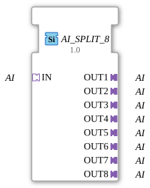

# AI_SPLIT_8

* * * * * * * * * *
## Introduction

The function block **AI_SPLIT_8** is used to distribute an analog input signal (type *AI*) to eight identical analog output signals. The block is implemented as a generic FB (GenericClassName: `GEN_AI_SPLIT`) and is used in the 4diac IDE to make a single analog signal usable multiple times.
## Interface Structure

### **Event Inputs**

No event inputs available.

### **Event Outputs**

No event outputs available.

### **Data Inputs**

No data inputs available.

### **Data Outputs**

No data outputs available.

### **Adapter**

| Name | Type | Direction | Description |
|------|-----|----------|--------------|
| **IN** | `adapter::types::unidirectional::AI` | Socket (Input) | Receives the analog signal, which is distributed to all outputs. |
| **OUT1** – **OUT8** | `adapter::types::unidirectional::AI` | Plug (Output) | Eight identical outputs that provide the signal present at the input. |

## Functionality

The FB has no processing logic of its own (no state machine, no ECC). The analog signal present at the adapter socket **IN** is passed directly and without delay to all eight adapter plugs (**OUT1** to **OUT8**). No signal conversion or amplification takes place – the signal is duplicated one-to-one.

## Technical Features

- **Generic Function Block:** The function block is declared as a generic type (`GEN_AI_SPLIT`) and can therefore be parameterized with a specific analog data type at runtime.
- **Unidirectional Adapters:** All adapters used are unidirectional, meaning that data flows exclusively from the socket to the plugs.
- **No Event Control:** Distribution is eventless; an incoming signal is immediately forwarded to all outputs.

## State Overview

The function block does not have an internal state machine (ECC). There are no defined states – the function block operates continuously and without its own behavior.

## Application Scenarios

- **Signal Distribution:** An analog sensor signal (e.g., temperature, pressure) is to be sent to multiple control modules or monitoring units simultaneously.
- **Redundancy:** Multiple parallel evaluations of the same signal in different parts of a system.
- **Prototyping:** Quickly deploy a signal to multiple test points in a development or simulation environment.

## Comparison with similar function blocks

- **AI_SPLIT_2, AI_SPLIT_4:** These function blocks distribute an analog signal to two or four outputs, respectively. The present function block offers a higher number of parallel connections with eight outputs.
- **DIO_SPLIT (digital):** A similar splitter for digital signals, but based on DI/DO adapter types. The AI_SPLIT_8 is specifically designed for analog signals.

## Conclusion

The **AI_SPLIT_8** is a simple, generic function block for multiplying an analog signal. Its clear structure—one input, eight outputs, no events—makes it ideal for straightforward signal distribution in automation applications. Its generic nature allows for flexible adaptation to various analog data types.

---

### 🌐 Related topic subpages on ms-muc-docs.de

* [🌐 Eclipse 4diac IDE & Color Reference on ms-muc-docs.de](https://www.ms-muc-docs.de/iec-61499/eclipse-4diac/)

]
