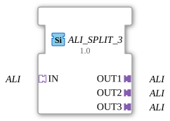

# ALI_SPLIT_3

* * * * * * * * * *
## Introduction

The function block **ALI_SPLIT_3** is used to distribute an incoming unidirectional adapter of type **ALI** (Application Layer Interface) to three identical output adapters of the same type. It is designed as a generic component and enables signal multiplication without data modification.
## Interface Structure

### **Event Inputs**

– None –

### **Event Outputs**

– None –

### **Data Inputs**

– None (all communication takes place via the adapter interfaces)

### **Data Outputs**

### **Adapter**

| Direction | Name | Type | Description |
|----------|------|-----|--------------|
Socket (Input) | `IN` | `adapter::types::unidirectional::ALI` | Receives the incoming ALI signal. |
Plug (Output) | `OUT1` | `adapter::types::unidirectional::ALI` | First output copy of the signal. |
Plug (Output) | `OUT2` | `adapter::types::unidirectional::ALI` | Second output copy of the signal. |
Plug (Output) | `OUT3` | `adapter::types::unidirectional::ALI` | Third output copy of the signal. |

**Note:** The adapter type `ALI` is a unidirectional interface adapter that typically encapsulates data and event flow in one direction. The exact internal structure is defined application-specifically.

## Functionality

The function block performs a pure 1:3 distribution of the ALI adapter connected to socket `IN`. All information received at the input (e.g., data values, events, or states) is forwarded in parallel to the three outputs `OUT1`, `OUT2`, and `OUT3` without delay or transformation. No buffering or logic takes place – the function block operates purely synchronously with the data flow.

## Technical Features

- **Generic Type:** The function block is declared as a generic function block (`eclipse4diac::core::GenericClassName = 'GEN_ALI_SPLIT'`). This allows the actual adapter type to be defined at configuration time, provided the underlying system supports this.
- **No Internal Dynamics:** The function block has no event or data inputs/outputs outside of the adapters. All communication takes place exclusively via the adapter interfaces.
- **Low Latency:** By eliminating internal processing, signal distribution is virtually delay-free.

## State Overview

The function block has no state machines or state memory. Its behavior is deterministic and purely combinatorial: The current input state is immediately mapped to all outputs.

## Application Scenarios

- **Signal Multiplication in Control Systems:** If an ALI signal (e.g., a sensor data stream) is required multiple times by different downstream function blocks, ALI_SPLIT_3 can handle the distribution.
- **Test and Simulation Environments:** Multiple components are supplied with the same input signal to observe parallel responses.
- **Redundancy:** A signal is split across three paths, which are processed independently (e.g., for comparison or fault detection).

## Comparison with Similar Function Blocks

- **ALI_SPLIT_2:** Distributes an ALI signal to two outputs instead of three. ALI_SPLIT_3 extends this number to three.
- **ALI_MERGE (hypothetical):** Combines multiple ALI inputs into one output – functionally the opposite.
- **Event-Based Splitters (e.g., E_SPLIT):** Work with pure events, while ALI_SPLIT_3 distributes data and event components together via a single adapter.

## Change Detection

Each output plug is updated independently: the incoming value is written to a given output, and its adapter event sent, only if it differs from that output's current value. Outputs that are already in sync stay quiet, while an output that was just connected (or has drifted out of sync) still receives the update it needs.

## Conclusion

ALI_SPLIT_3 is a simple yet useful function block for multiplying ALI adapter connections. Its generic nature and pure signal transmission make it a flexible tool in automation and control engineering, especially when a signal is needed multiple times.

---

### 🌐 Related topic subpages on ms-muc-docs.de

* [🌐 Eclipse 4diac IDE & Color Reference on ms-muc-docs.de](https://www.ms-muc-docs.de/iec-61499/eclipse-4diac/)

]
