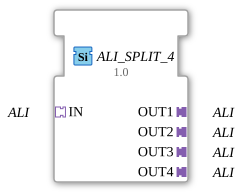

# ALI_SPLIT_4

* * * * * * * * * *

## Introduction

The function block **ALI_SPLIT_4** is used to distribute a single ALI adapter input (type: `adapter::types::unidirectional::ALI`) to four separate ALI adapter outputs. It is designed as a generic function block (FB) and enables unidirectional signal transmission from one source to up to four destinations.

## Interface Structure

### **Event Inputs**

No event inputs available.

### **Event Outputs**

No event outputs available.

### **Data Inputs**

No data inputs available.

### **Data Outputs**

No data outputs available.

### **Adapters**

| Direction | Name | Type | Description |

|----------|--------|----------------------------------|----------------------------------------------------|

Socket | IN | adapter::types::unidirectional::ALI | Unidirectional ALI Input (Source) |

Plug | OUT1 | adapter::types::unidirectional::ALI | First ALI Output (Destination) |

Plug | OUT2 | adapter::types::unidirectional::ALI | Second ALI Output (Destination) |

Plug | OUT3 | adapter::types::unidirectional::ALI | Third ALI Output (Destination) |

Plug | OUT4 | adapter::types::unidirectional::ALI | Fourth ALI Output (Destination) |

## Functionality

The function block receives an ALI adapter connection via socket **IN** and forwards the incoming signals unchanged to all four plugs **OUT1** to **OUT4**. No data processing, filtering, or logical operation takes place – the distribution is purely passive. Due to its generic implementation, the function block can be used in various contexts where an ALI signal is required multiple times.

## Technical Features

- The function block is declared as a generic function block (`GEN_ALI_SPLIT`), which allows for flexible type customization in the 4diac IDE development environment.

- No events or data points are required – all communication occurs exclusively via the adapter interfaces.

- The function block is unidirectional: feedback from the outputs to the input is not provided.

- The attributes `GenericClassName` and `TypeHash` serve for the unique identification and versioning of the generic type.

## State Overview

The function block has no states or control logic of its own. Its behavior is deterministic and consists solely of forwarding the adapter signal. Therefore, a separate state machine is not required.

## Application Scenarios

- **Signal Distribution**: A central ALI data stream (e.g., from a sensor or control unit) is to be sent in parallel to several downstream components.

- **Prototyping**: In early development phases, the function block can be used to quickly distribute a signal to multiple test units.

- **Redundancy**: Multiple identical outputs allow for the connection of backup systems or separate monitoring units.

## Comparison with Similar Function Blocks

- **ALI_SPLIT_2**: Distributes the input signal to two outputs instead of four. The ALI_SPLIT_4 offers twice the number of output channels.

- **ALI_MERGE**: Combines multiple ALI inputs into one output – the inverse function of the split function.

- **ALI_SELECT**: Selects one of several inputs based on a control signal and routes it to an output (no parallel distribution).

## Conclusion

The **ALI_SPLIT_4** is a simple yet useful function block for passively distributing a unidirectional ALI signal to four identical outputs. Its generic design and the absence of event or data logic make it particularly suitable for rapid signal multiplication in automation technology without incurring additional processing load.

---

### 🌐 Related topic subpages on ms-muc-docs.de

* [🌐 Eclipse 4diac IDE & Color Reference on ms-muc-docs.de](https://www.ms-muc-docs.de/iec-61499/eclipse-4diac/)

]