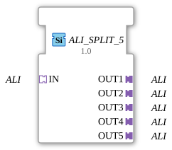

# ALI_SPLIT_5

* * * * * * * * * *
## Introduction
The function block `ALI_SPLIT_5` is a generic adapter split block. It accepts a single incoming ALI adapter (`adapter::types::unidirectional::ALI`) and provides the same ALI signals at five outgoing ALI adapter interfaces. This allows an ALI connection to be distributed to multiple subsequent blocks or devices without interrupting the logical signal chain.
## Interface Structure

### **Event Inputs**
- None

### **Event Outputs**
- None

### **Data Inputs**
- None

### **Data Outputs**
- None

### **Adapters**

| Direction | Name | Type | Description |
|----------|------|-----|--------------|

Input (Socket) | `IN` | `adapter::types::unidirectional::ALI` | Single input: contains the ALI data to be distributed to the five outputs. |

Output (Plug) | `OUT1` | `adapter::types::unidirectional::ALI` | First output (identical signals as at the input). |

Output (Plug) | `OUT2` | `adapter::types::unidirectional::ALI` | Second output. |

Output (Plug) | `OUT3` | `adapter::types::unidirectional::ALI` | Third output. |

| Output (Plug) | `OUT4` | `adapter::types::unidirectional::ALI` | Fourth output. |

| Output (Plug) | `OUT5` | `adapter::types::unidirectional::ALI` | Fifth output. |

## Functionality

As soon as the module is connected to socket `IN` via a valid ALI connection, all data and event traffic from the incoming adapter is forwarded **unchanged** and **in parallel** to the five plug adapters `OUT1` to `OUT5`. No logical processing, filtering, or delay takes place – the function block acts as a passive distribution unit (“splitter”) for the ALI channel.

The forwarding is bidirectional according to the ALI adapter definition: Both events and data (as defined in the ALI type) are made available synchronously at all outputs. The function block has no internal runtime logic or state.

## Technical Features
- **Generic Function Block** – The specific implementation is controlled by the meta attributes `GenericClassName` and `TypeHash`. This allows the same function block definition to be reused for different ALI variants (e.g., with different data structures).
- **No Delay** – The signals are replicated to the outputs without any significant delay.
- **Easily Expandable** – The principle of this splitter can be transferred to other adapter types; the generic architecture eliminates the need to modify the basic logic.
- **Direct Coupling** – The output state always corresponds to the current input state; there is no buffering or intermediate storage.

## State Overview

The component has **no internal state machine**. It operates directly and without delay as a pure connection switch ("wired split"). State changes occur only through the connected adapter partners, and these are passed on transparently.

## Application Scenarios
- **Distributing a sensor signal** to multiple evaluation units or controllers that require the same ALI data stream.
- **Parallelizing ALI communication paths** in a machine controller to supply redundant or independent processing chains.
- **Test and debugging environments** where an ALI signal needs to be simultaneously monitored and recorded.

## Comparison with similar components

Other split or fanout components usually offer a fixed number of outputs or are restricted to specific data types. The `ALI_SPLIT_5` is specifically designed for the unidirectional ALI adapter, but its generic template allows for flexible application. Unlike a **multiplexer** or **router**, this component always forwards the signal to all outputs **without switching**.

## Conclusion

The `ALI_SPLIT_5` is a simple yet essential component for multiplying an ALI signal. Due to its generic nature, it can be easily integrated into various 4diac projects and simplifies signal distribution in complex automation architectures. It requires little maintenance because it contains no internal logic and contributes to the modularization and reusability of ALI connections.

---

### 🌐 Related topic subpages on ms-muc-docs.de
* [🌐 Eclipse 4diac IDE & Color Reference on ms-muc-docs.de](https://www.ms-muc-docs.de/iec-61499/eclipse-4diac/)

]
