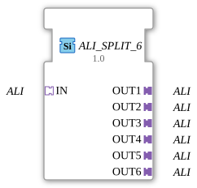

# ALI_SPLIT_6

* * * * * * * * * *
## Introduction
The ALI_SPLIT_6 function block is used to distribute an incoming unidirectional ALI (Application Layer Interface) adapter signal to six identical outputs. It is designed as a generic function block and enables simple signal multiplication without additional logic.
## Interface Structure

### **Event Inputs**
*None*

### **Event Outputs**
*None*

### **Data Inputs**
*None*

### **Data Outputs**
*None*

### **Adapter**

| Type | Name | Direction | Description |

|-----|------|----------|--------------|

| `adapter::types::unidirectional::ALI` | `IN` | Socket (Input) | An ALI adapter whose signal is distributed to all outputs. |

| `adapter::types::unidirectional::ALI` | `OUT1` | Plug (Output) | First output carrying the input signal. |

| `adapter::types::unidirectional::ALI` | `OUT2` | Plug (Output) | Second output carrying the input signal. |

| `adapter::types::unidirectional::ALI` | `OUT3` | Plug (Output) | Third output carrying the input signal. |

| `adapter::types::unidirectional::ALI` | `OUT4` | Plug (Output) | Fourth output with the input signal. |

| `adapter::types::unidirectional::ALI` | `OUT5` | Plug (Output) | Fifth output with the input signal. |

| `adapter::types::unidirectional::ALI` | `OUT6` | Plug (Output) | Sixth output with the input signal. |

## Functionality

The ALI_SPLIT_6 implements a simple 1:6 distribution. The ALI adapter signal received via socket `IN` is forwarded unchanged and simultaneously to all six plugs (`OUT1` to `OUT6`). No signal processing, delay, or state changes occur. The distribution is purely structural via the adapter connections.

## Functionality ## Technical Features
- **Generic Function Block:** The FB is defined as a generic function block. The specific class name (e.g., `eclipse4diac::core::GenericClassName`) can be defined via the attribute `'GEN_ALI_SPLIT'`. The attribute `eclipse4diac::core::TypeHash` can be used to identify the specific configuration.
- **No State Machines:** The FB has no ECC (Execution Control Chart) and no internal logic. It operates purely passively.
- **Unidirectional ALI Adapter Interface:** Both inputs and outputs use the type `adapter::types::unidirectional::ALI`, which enables simple and standardized communication.

## State Overview

The FB does not have its own states or behavior modes, as it only performs structural routing. Therefore, state analysis is not required.

## Application Scenarios
- **Controlling Multiple Actuators:** An ALI signal, e.g., a enable or control signal, is to be simultaneously transmitted to six receivers (e.g., servo motors or valve manifolds).
- **Signal Distribution in Modular Systems:** In an industrial control system, a central ALI signal can be distributed to multiple decentralized units.
- **Replacing Manual Wiring:** The FB replaces the physical distribution of a signal with a software-defined, maintainable solution.

## Comparison with Similar Function Blocks

| Function Block | Outputs | Special Features |

|----------|----------|--------------|

| ALI_SPLIT_2 | 2 | Dual Distribution |

| ALI_SPLIT_4 | 4 | Quadruple Distribution |

| **ALI_SPLIT_6** | **6** | **Six-Way Distributor, Generic** |

| ALI_SPLIT_8 | 8 | Eight-Way Distributor |

The ALI_SPLIT_6 differs from other split variants only in the number of outputs. All function blocks in this family operate on the same passive distribution principle. The function block described here is implemented as a generic block, while other variants may be implemented as simple function block types without genericity.

## Conclusion

The ALI_SPLIT_6 is a simple yet useful function block for multiplying a unidirectional ALI adapter signal to six identical outputs. Thanks to its generic properties, it can be flexibly integrated into various control systems. Due to the lack of processing logic, it is particularly resource-efficient and easy to understand. It is ideally suited for applications where a signal needs to be provided to multiple receivers simultaneously.

### 🌐 Related topic subpages on ms-muc-docs.de
* [🌐 Eclipse 4diac IDE & Color Reference on ms-muc-docs.de](https://www.ms-muc-docs.de/iec-61499/eclipse-4diac/)
