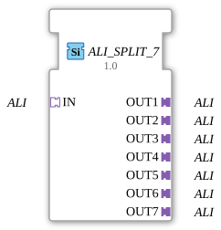

# ALI_SPLIT_7

* * * * * * * * * *
## Introduction
The function block **ALI_SPLIT_7** is a generic splitter that distributes one incoming ALI adapter (socket `IN`) to seven outgoing ALI adapters (plugs `OUT1`…`OUT7`). It is used for a 1:7 distribution of data and events within a unidirectional ALI communication path.
## Interface Structure
### **Event Inputs**
None.

#### **Event Outputs**
None.

#### **Data Inputs**
None.

#### **Data Outputs**
None.

#### **Adapters**

| Direction | Name | Type | Description |

|----------|------|-------------------|-------------|

Socket (Input) | `IN` | `adapter::types::unidirectional::ALI` | Input adapter whose data and events are distributed. |

Plug (Output) | `OUT1` | `adapter::types::unidirectional::ALI` | First output adapter. |

Plug (Output) | `OUT2` | `adapter::types::unidirectional::ALI` | Second output adapter. |

Plug (Output) | `OUT3` | `adapter::types::unidirectional::ALI` | Third output adapter. |

Plug (Output) | `OUT4` | `adapter::types::unidirectional::ALI` | Fourth Output Adapter. |

| Plug (Output) | `OUT5` | `adapter::types::unidirectional::ALI` | Fifth Output Adapter. |

| Plug (Output) | `OUT6` | `adapter::types::unidirectional::ALI` | Sixth Output Adapter. |

| Plug (Output) | `OUT7` | `adapter::types::unidirectional::ALI` | Seventh Output Adapter. |
...
## Functionality

The function block forwards all incoming ALI signals (both data and events) via socket `IN` unchanged to all seven output adapters `OUT1`…`OUT7`. This results in a strict 1:7 parallel distribution without delay or buffering. The function block behaves purely combinatorially; no processing or filtering of the contents takes place.

## Technical Features
- **Generic Type**: The function block is declared as a generic function block (`GenericClassName = 'GEN_ALI_SPLIT'`). This allows it to be used with different ALI adapter variants, provided they support the same interface protocol (unidirectional adapters).
- **No States**: The function block does not have a state machine (ECC) and does not store any data. Each iteration is deterministic and has no side effects.
- **Flexible Distribution**: With its fixed number of seven outputs, the FB is particularly suitable for applications requiring distribution across exactly seven paths.

## State Overview
The FB has **no explicit states**. Its functionality is purely passive and data flow-driven.

## Application Scenarios
- **Parallel Signal Distribution**: An ALI data stream sent by a higher-level control module is to be simultaneously passed on to several downstream modules (e.g., actuators, visualizations, or logging systems).
- **Redundancy or Load Balancing**: Several identical processing units receive the same ALI input data and operate independently.
- **Adapter Conversion**: In combination with specialized ALI adapters, the splitter can be used to multiply a data path across different logic or hardware interfaces.

## Comparison with Similar Function Blocks
- **ALI_SPLIT_2 / ALI_SPLIT_4**: These function blocks offer splits to two or four outputs, respectively. `ALI_SPLIT_7` is the extension to seven outputs for specific requirements.
- **ALI_MERGE**: The counterpart that combines multiple ALI inputs into one output. A splitter like `ALI_SPLIT_7` operates in the opposite direction (fan-out).

## Conclusion

The **ALI_SPLIT_7** is a specialized, generic function block for the clean and lossless 1:7 distribution of unidirectional ALI signals. Its simple structure, lack of state logic, and generic design make it ideal for modular control architectures where a signal needs to be passed to multiple receivers in parallel.
