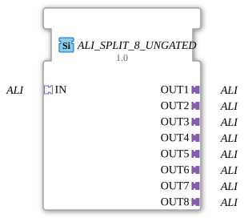

# ALI_SPLIT_8_UNGATED

> ℹ️ **UNGATED variant:** This block is the ungated version of [`ALI_SPLIT_8`](ALI_SPLIT_8.md). It suppresses **no** unchanged repeats – every newly computed result is forwarded unconditionally, even without a value change. This matters for consumers that need a periodic cadence regardless of value change (e.g. derivative/frequency calculations that would otherwise fail to decay toward zero). Any change-detection/gating statements further down this page do **not** apply to this block.

* * * * * * * * * *

## Introduction

The function block `ALI_SPLIT_8_UNGATED` serves as a generic splitter for the **Agricultural Light Interface (ALI)**. It distributes an incoming ALI signal unchanged to eight parallel outputs. This allows multiple downstream devices or controllers to be supplied with the same signal without compromising signal integrity.

## Interface Structure

### **Event Inputs**

No event inputs available.

### **Event Outputs**

No event outputs available.

### **Data Inputs**

No data inputs available.

### **Data Outputs**

No data outputs available.

### **Adapter**

- **Socket (Input):**

IN` – of type `adapter::types::unidirectional::ALI`
Receives the incoming ALI signal.

- **Plugs (Outputs):**

OUT1` … `OUT8` – each of type `adapter::types::unidirectional::ALI`
Provide the eight identical copies of the input signal.

## Functionality

The module forwards the ALI signal present at socket `IN` unchanged and without delay to all eight plugs (`OUT1` … `OUT8`). Since this is purely signal distribution, no processing, buffering, or status changes occur. All events and data transmitted via the ALI adapter are replicated to each output.

## Technical Features

- **Generic Function Block:** The function block is defined as a generic type (`GEN_ALI_SPLIT`) and can be used in various contexts within the ALI ecosystem.
- **No ECC:** There is no execution state machine (ECC); distribution is purely combinatorial.
- **Unidirectional:** The adapter type is unidirectional – the signal flows only from the socket to the plugs; feedback is not provided.
- **Scalability:** Due to its modular design, similar splitters for other output numbers (e.g., `ALI_SPLIT_2`) can be derived.

## State Overview

The function block has no internal states or sequential logic. Signal distribution operates continuously and without delay.

## Application Scenarios

- **Distribution Circuits:** An ALI signal (e.g., from a control unit) must be simultaneously transmitted to multiple actuators or sensors.
- **Redundancy:** Parallel control of identical components without requiring separate signal sources.
- **Bus Structures:** Construction of star-shaped ALI networks with a central splitter.

## Comparison with Similar Components

Other splitter components such as `ALI_SPLIT_2`, `ALI_SPLIT_4`, or `ALI_SPLIT_N` differ only in the number of outputs. The `ALI_SPLIT_8_UNGATED` offers the maximum distribution in the standard family. Unlike a multiplexer (`ALI_MUX`) or a switch (`ALI_SWITCH`), here **each output is supplied with the same signal** – no selection or switching takes place.

## Change Detection

This block performs **no** change detection. Every newly computed result is written to the output and its adapter event fired unconditionally, regardless of whether the value differs from the previous run.

## Conclusion

The `ALI_SPLIT_8_UNGATED` is a simple yet essential component for multiplying ALI signals. Its generic definition and the absence of state logic make it particularly suitable for robust, low-latency distributions in agricultural automation.
