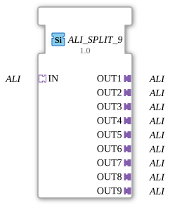

# ALI_SPLIT_9

* * * * * * * * * *
## Introduction
The **ALI_SPLIT_9** is a generic function block (FB) within the 4diac IDE, used to split an incoming **ALI** adapter signal (unidirectional) into up to nine separate output adapters. The block is implemented as a generic type ("Generic FB") and is typically customized using the type parameters `eclipse4diac::core::GenericClassName` and `eclipse4diac::core::TypeHash`. The goal is flexible signal distribution without additional logic, purely at the adapter level.
## Interface Structure
### **Event Inputs**
None

### **Event Outputs**
None

### **Data Inputs**
None

### **Data Outputs**
None

### **Adapters**

| Direction | Name | Type | Description |

|----------|------|-----|--------------|

Socket (Input) | IN | `ALI` (unidirectional) | Input of the ALI signal to be distributed |

Plug (Output 1) | OUT1 | `ALI` (unidirectional) | First output – identical copy of the input signal |

Plug (Output 2) | OUT2 | `ALI` (unidirectional) | Second output |

Plug (Output 3) | OUT3 | `ALI` (unidirectional) | Third output |

Plug (Output 4) | OUT4 | `ALI` (unidirectional) | Fourth exit |
| Plug (output 5) | OUT5 | `ALI` (unidirectional) | Fifth exit |
| Plug (output 6) | OUT6 | `ALI` (unidirectional) | Sixth exit |
| Plug (output 7) | OUT7 | `ALI` (unidirectional) | Seventh exit |
| Plug (output 8) | OUT8 | `ALI` (unidirectional) | Eighth exit |
| Plug (output 9) | OUT9 | `ALI` (unidirectional) | Ninth exit |

## Functionality

The function block operates passively as a pure **signal distributor**. The ALI adapter protocol applied to socket **IN** is duplicated unchanged to all nine plug outputs **OUT1…OUT9**. No data processing, event generation, or filtering takes place. Each output provides an identical logical and temporal copy of the incoming signal.

The internal implementation uses the generic type mechanisms of the 4diac IDE (`GenericClassName` and `TypeHash`), allowing the function block to be specifically adapted to the project requirements at runtime.

## Technical Features
- **Generic Function Block**: The function block is declared as `GEN_ALI_SPLIT` (according to the attribute `eclipse4diac::core::GenericClassName`). Specific instances receive a unique type identifier via `TypeHash`.
- **No Events or Data**: The interface consists exclusively of adapters; there are no event inputs/outputs or data inputs/outputs.
- **Unidirectional ALI Adapters**: All adapters used are of type `adapter::types::unidirectional::ALI`, meaning communication is one-way (input → outputs). Feedback from the outputs to the input is not supported.
- **Simple Topology**: The module implements a 1:9 star distribution without additional buffers or synchronization.

## State Overview
The module does not have its own state machine. Its behavior is determined solely by the adapter interfaces: As long as socket **IN** provides a signal, all nine plugs are active. As soon as **IN** becomes inactive (no signal), all outputs also provide no signal.

## Application Scenarios
- **Distributing an ALI bus signal** to multiple downstream subsystems (e.g., sensor data to multiple controllers).
- **Splitting a master signal** for redundancy or parallel processing in plant control.
- **Test and debugging environments**: An ALI signal can be simultaneously routed to an analyzer and multiple target systems.
- **Generic interface extension**: When a system has only one ALI output but needs to serve multiple devices.

## Comparison with similar components
- **ALI_SPLIT_2 / ALI_SPLIT_4 / ALI_SPLIT_8**: Variants with 2, 4, or 8 outputs. The component described here offers the maximum split to 9 channels.
- **ALI_MERGE** (hypothetical): Combines multiple ALI inputs into one output – the opposite function.
- **Event-based splitters**: Other components use events to control the signal flow; this adapter splitter operates in a signal-driven manner without event logic.

## Conclusion

The **ALI_SPLIT_9** is a specialized, generic adapter function block (FB) that enables the simple and reliable distribution of a unidirectional ALI signal to up to nine separate receivers in industrial automation using the 4diac IDE. Its pure adapter interface makes it particularly resource-efficient and ideally suited for star network topologies in IEC 61499-based systems. Its generic nature allows for flexible adaptation to specific requirements without changing the block structure.

---

### 🌐 Related topic subpages on ms-muc-docs.de
* [🌐 Eclipse 4diac IDE & Color Reference on ms-muc-docs.de](https://www.ms-muc-docs.de/iec-61499/eclipse-4diac/)

]
