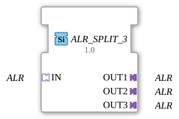

# ALR_SPLIT_3

* * * * * * * * * *
## Introduction

The function block **ALR_SPLIT_3** serves as a generic SPLIT function block that splits an incoming ALR signal (alarm or event signal) into three identical outputs. It is primarily used in automation systems where a single signal needs to be distributed in parallel to multiple downstream components without altering the signal quality or logic.
## Interface Structure

### **Event Inputs**

No event inputs available.

### **Event Outputs**

No event outputs available.

### **Data Inputs**

No data inputs available.

### **Data Outputs**

No data outputs available.

### **Adapter**

* **IN** – *Socket* (Input) of type `adapter::types::unidirectional::ALR`
Receives the ALR signal to be distributed.

* **OUT1** – *Plug* (Output 1) of type `adapter::types::unidirectional::ALR`
Passes the incoming signal on unchanged.

* **OUT2** – *Plug* (Output 2) of type `adapter::types::unidirectional::ALR`

* **OUT3** – *Plug* (Output 3) of type `adapter::types::unidirectional::ALR`

## Functionality

This module functions purely as a signal distributor. As soon as an ALR signal is present at the adapter socket **IN** (e.g., an alarm state, an event, or an activation), this signal is forwarded to all three adapter plugs **OUT1**, **OUT2**, and **OUT3** without delay or manipulation. No logical processing or filtering takes place. Distribution is handled passively via the connection logic of the 4diac IDE.

## Technical Features

* **Generic Function Block** – The block can be created as a generic instance using the attributes `eclipse4diac::core::GenericClassName` and `eclipse4diac::core::TypeHash`. This allows for easy reuse and parameterization in different projects.
* **No State Machine** – The block does not have an ECC (Execution Control Chart), as its behavior is defined solely by the adapter connectivity.
* **Unidirectional Adapters** – All ALR adapters used are of type `unidirectional`; the signal direction is fixed (input → outputs).

## State Overview

The function block does not define any internal states. The output signal always corresponds instantaneously to the input signal. A separate state description is therefore not required.

## Application Scenarios

* **Alarm Distribution** – A central alarm detector (e.g., a higher-level control system) is connected to three independent control units that are intended to react to the alarm in parallel.
* **Signal Multiplexing** – A Boolean or value-based signal from a sensor is distributed to multiple actuators or visualizations.
* **Redundancy Architectures** – The same signal is sent to two or three independent paths to achieve fault tolerance.

## Comparison with Similar Function Blocks

* **ALR_SPLIT_2** – Distributes a signal to two outputs (identical function, but fewer outputs).
* **ALR_SPLIT_4** – Distributes one signal to four outputs.
* **Manual Coupling** – Without the SPLIT function block, the signal would have to be tapped multiple times in the application or distributed via a common line, which reduces clarity and maintainability.

## Change Detection

Each output plug is updated independently: the incoming value is written to a given output, and its adapter event sent, only if it differs from that output's current value. Outputs that are already in sync stay quiet, while an output that was just connected (or has drifted out of sync) still receives the update it needs.

## Conclusion

The **ALR_SPLIT_3** is a simple yet useful generic function block for multiplying an ALR signal. It facilitates structured and reusable interconnection in automation solutions where a signal needs to be passed on to multiple receivers without additional logic or latency.

---

### 🌐 Related topic subpages on ms-muc-docs.de

* [🌐 Eclipse 4diac IDE & Color Reference on ms-muc-docs.de](https://www.ms-muc-docs.de/iec-61499/eclipse-4diac/)

]
