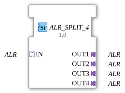

# ALR_SPLIT_4

* * * * * * * * * *
## Introduction

The function block **ALR_SPLIT_4** splits an incoming ALR adapter signal into four identical outputs. It is a generic function block (FB) that can be used with various ALR adapter types.
## Interface Structure

### **Event Inputs**

No event inputs are available. Event control is handled via the input adapter.

### **Event Outputs**

No event outputs are available. Events are forwarded via the output adapters.

### **Data Inputs**

No data inputs are available. Data is provided via the input adapter.

### **Data Outputs**

No data outputs are available. Data is output via the output adapters.

### **Adapters**

- **Socket (Input)**:
- **IN**: Unidirectional ALR adapter (type `adapter::types::unidirectional::ALR`). Receives the incoming signal.
- **Plugs (Outputs)**:
- **OUT1**, **OUT2**, **OUT3**, **OUT4**: Each a unidirectional ALR adapter (same type). Outputs the distributed signal.

## Functionality

The module features direct pass-through: All events and data arriving at the input adapter **IN** are passed on unchanged and simultaneously to the four output adapters **OUT1** to **OUT4**. No processing, buffering, or filtering takes place. The module operates purely combinationally.

## Technical Features

- **Generic Type**: The specific ALR adapter type can be defined at design time using the attribute `eclipse4diac::core::GenericClassName` (e.g., `'GEN_ALR_SPLIT'`).
- **Unidirectional**: The data flow direction is fixed from input to output. Backward communication is not supported.
- **No State Logic**: The function block does not contain an event-driven state machine (ECC) and does not include any time delays.

## State Overview

The function block does not have its own states. Signal transmission is continuous and instantaneous.

## Application Scenarios

- Distribution of an ALR signal (e.g., control commands, status messages) to multiple parallel modules or actuators.
- Creation of branches in adapter-based communication when multiple downstream components require the same information.
- Use in modular automation systems where a common signal needs to be split across multiple identical units.

## Comparison with similar components

- **ALR_SPLIT_2 / ALR_SPLIT_N**: Split components with a different number of outputs (e.g., 2 or 8).
- **Event Splitters**: Split events but operate at the event level only. ALR_SPLIT_4, on the other hand, distributes complete adapter signals (events and data encapsulated).
- **Data Splitters**: Distribute individual data values, but without adapter encapsulation. ALR_SPLIT_4 is specifically optimized for use with unidirectional ALR adapter types.

## Conclusion

**ALR_SPLIT_4** is a simple yet essential component for multiplying adapter connections. Its generic design allows it to be used with various ALR adapter types without requiring any modification to the block logic. It is particularly suitable for modular architectures where a signal needs to be distributed to multiple receivers in parallel.

---

### 🌐 Related topic subpages on ms-muc-docs.de

* [🌐 Eclipse 4diac IDE & color reference on ms-muc-docs.de](https://www.ms-muc-docs.de/iec-61499/eclipse-4diac/)

]
