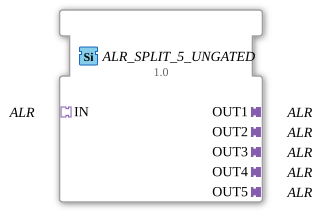

# ALR_SPLIT_5_UNGATED

> ℹ️ **UNGATED variant:** This block is the ungated version of [`ALR_SPLIT_5`](ALR_SPLIT_5.md). It suppresses **no** unchanged repeats – every newly computed result is forwarded unconditionally, even without a value change. This matters for consumers that need a periodic cadence regardless of value change (e.g. derivative/frequency calculations that would otherwise fail to decay toward zero). Any change-detection/gating statements further down this page do **not** apply to this block.

* * * * * * * * * *

## Introduction

The function block **ALR_SPLIT_5_UNGATED** is used to distribute an incoming ALR signal to five identical outputs. It is implemented as a generic function block (Generic FB) and enables simple signal multiplication in control systems based on the adapter concept of IEC 61499.

## Interface Structure

### Event Inputs

No event inputs are available.

### Event Outputs

No event outputs are available.

### Data Inputs

No data inputs are available. All data transmission occurs exclusively via adapters.

### Data Outputs

No data outputs are available.

### **Adapter**

The module has one socket (input) and five plugs (outputs):

| Direction | Name | Type | Description |
| ---------- | ------ | ----- | -------------- |
| Input | IN | `adapter::types::unidirectional::ALR` | Receives the ALR signal to be distributed |
| Output | OUT1 | `adapter::types::unidirectional::ALR` | First output with the identical ALR signal |
| Output | OUT2 | `adapter::types::unidirectional::ALR` | Second output with the identical ALR signal |
| Output | OUT3 | `adapter::types::unidirectional::ALR` | Third output with the identical ALR signal |
| Output | OUT4 | `adapter::types::unidirectional::ALR` | Fourth output with the identical ALR signal |
| Output | OUT5 | `adapter::types::unidirectional::ALR` | Fifth output with the identical ALR signal |

## Functionality

This function block forwards the ALR signal received from socket `IN` unchanged to all five plugs `OUT1` to `OUT5`. This is a purely combinational forwarding process – no logic, delay, or data manipulation takes place. The block operates without requiring an event or state; as soon as a signal is present at the input, it is available at all outputs.

This function block forwards the ALR signal received from socket `IN` unchanged to all five plugs `OUT1` to `OUT5`.

- **Generic Function Block:** The function block is defined as a Generic FB and uses the Eclipse 4diac Generics mechanisms (`eclipse4diac::core::GenericClassName`). This allows it to be used in various contexts without modifying the core logic.
- **Pure Adapter Communication:** No traditional event or data inputs/outputs are used. All communication takes place via adapters of type `ALR`, which enable unidirectional data exchange.
- **Simple Structure:** No state machines or time dependencies – the function block is deterministic and resource-efficient.

The function block has no explicit state logic or state machine. It operates entirely combinatorially, meaning the output signal is derived directly from the input signal without delay.

- **Signal Distribution in Automation:** A sensor delivers an ALR signal that must be forwarded in parallel to several actuators (e.g., valves, drives).
- **Redundancy:** The signal can be distributed to various control units or monitoring modules.
- **Test and Simulation Environments:** A central ALR signal is split across multiple test points to enable parallel evaluations.
- **ALR_SPLIT_2, ALR_SPLIT_3, ALR_SPLIT_4:** These function blocks split an ALR signal across two, three, and four outputs, respectively. This function block extends this to five outputs.
- **General Split Function Blocks (e.g., DATA_SPLIT):** Similar function blocks exist for other data types. Their functionality is identical; only the adapter type used differs. The advantage of ALR_SPLIT_5_UNGATED lies in its direct use of the ALR adapter protocol without additional type conversion.

The **ALR_SPLIT_5_UNGATED** is a simple yet valuable component for multiplying ALR signals in IEC 61499 systems. Its generic and combinatorial implementation makes it easy to integrate and resource-efficient. It is particularly suitable for applications where a signal needs to be distributed to multiple receivers without requiring additional logic or timing.

---

- [🌐 Eclipse 4diac IDE & color reference on ms-muc-docs.de](https://www.ms-muc-docs.de/iec-61499/eclipse-4diac/)

]

## Technical Features

## State Overview

## Application Scenarios

## Comparison with Similar Function Blocks

## Change Detection

This block performs **no** change detection. Every newly computed result is written to the output and its adapter event fired unconditionally, regardless of whether the value differs from the previous run.

## Conclusion

### 🌐 Passende Themen-Unterseiten auf ms-muc-docs.de
