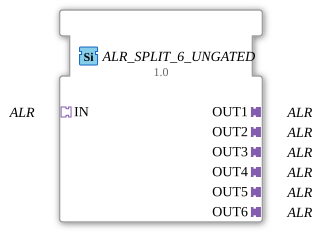

# ALR_SPLIT_6_UNGATED

> ℹ️ **UNGATED variant:** This block is the ungated version of [`ALR_SPLIT_6`](ALR_SPLIT_6.md). It suppresses **no** unchanged repeats – every newly computed result is forwarded unconditionally, even without a value change. This matters for consumers that need a periodic cadence regardless of value change (e.g. derivative/frequency calculations that would otherwise fail to decay toward zero). Any change-detection/gating statements further down this page do **not** apply to this block.

* * * * * * * * * *

## Introduction

The ALR_SPLIT_6_UNGATED function block is a generic 1:6 splitter for the adapter type `adapter::types::unidirectional::ALR`. It distributes an incoming ALR signal unchanged to six outputs and serves as a passive signal distributor without data manipulation.

## Interface Structure

### **Event Inputs**

None

### **Event Outputs**

None

### **Data Inputs**

None

#### **Data Outputs**

None

#### **Adapter**

| Name | Type | Direction | Description |
| ------ | ----- | ---------- | -------------- |
| IN | `adapter::types::unidirectional::ALR` | Socket (Input) | ALR input signal copied to all outputs |
| OUT1 | `adapter::types::unidirectional::ALR` | Plug (Output) | First ALR output |
| OUT2 | `adapter::types::unidirectional::ALR` | Plug (Output) | Second ALR output |
| OUT3 | `adapter::types::unidirectional::ALR` | Plug (Output) | Third ALR output |
| OUT4 | `adapter::types::unidirectional::ALR` | Plug (Output) | Fourth ALR output |
| OUT5 | `adapter::types::unidirectional::ALR` | Plug (Output) | Fifth ALR output |
| OUT6 | `adapter::types::unidirectional::ALR` | Plug (Output) | Sixth ALR Output |

## Functionality

This function block forwards the adapter signal present at Socket IN unchanged to all six plugs OUT1–OUT6. No transformation, delay, or selection takes place – all outputs always receive the identical signal copy. The function block is declared as a generic function block (`GEN_ALR_SPLIT`) and can be typed by specifying the concrete adapter type.

## Technical Features

- Purely passive splitter without events, data ports, or state machines.
- Generic implementation via the metadata `eclipse4diac::core::GenericClassName = 'GEN_ALR_SPLIT'`.
- All adapter interfaces are unidirectional; there are no return channels.
- No runtime dependencies or initialization are required.

## State Overview

The function block has no ECC (Execution Control Chart) and no internal states. It operates continuously and immediately forwards every incoming adapter signal to all outputs.

## Application Scenarios

- Duplication of an ALR signal for parallel loads in control networks.
- Signal distribution in agricultural automation systems (based on the ALR adapter context).
- Easy provision of an identical reference for multiple downstream logic blocks.

## Comparison with Similar Blocks

- **ALR_SPLIT_2 / ALR_SPLIT_3 / …** – same functionality, but with fewer outputs.
- **Event-based splitters (e.g., E_SPLIT)** – operate with event/data separation, while ALR_SPLIT_6_UNGATED uses adapters exclusively.
- **Data multiplexers** – select one output; ALR_SPLIT_6_UNGATED always activates all outputs.

- **[`ALR_SPLIT_6`](ALR_SPLIT_6.md)**: The gated variant – updates the output only on an actual value change.

## Change Detection

This block performs **no** change detection. Every newly computed result is written to the output and its adapter event fired unconditionally, regardless of whether the value differs from the previous run.

## Conclusion

ALR_SPLIT_6_UNGATED is a minimalist and reliable block for signal duplication at the adapter level. Its generic design facilitates reuse in different projects, and the absence of complex logic keeps the data flow model clear and simple.

---

### 🌐 Related topic subpages on ms-muc-docs.de

- [🌐 Eclipse 4diac IDE & Color Reference on ms-muc-docs.de](https://www.ms-muc-docs.de/iec-61499/eclipse-4diac/)

]
