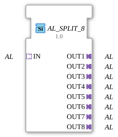

# AL_SPLIT_8

* * * * * * * * * *
## Introduction
The function block `AL_SPLIT_8` distributes an incoming unidirectional AL signal (socket `IN`) to eight identical outputs (plugs `OUT1` to `OUT8`). It is declared as a generic block and serves for simple signal multiplication in 4diac applications.
## Interface Structure

### **Event Inputs**
None

### **Event Outputs**
None

### **Data Inputs**
None

### **Data Outputs**
None

### **Adapters**

| Type | Name | Direction | Description |
|-----|------|----------|--------------|

| `adapter::types::unidirectional::AL` | `IN` | Socket (Input) | Incoming AL signal |

| `adapter::types::unidirectional::AL` | `OUT1` … `OUT8` | Plugs (Output) | Eight outgoing AL signals |

## Functionality

The component has no internal logic or state machine. An AL adapter signal applied to `IN` is forwarded unchanged and simultaneously to all eight output adapters. This multiplication is purely data-flow controlled, without delay or buffering.

## Technical Features
- **Generic Type**: The function block is declared as a generic block (`GenericClassName = 'GEN_AL_SPLIT'`), but due to the fixed adapter definition, it can only be used with the type `AL`.
- **No Event Control**: There is neither an ECC nor an event interface; data is passed passively via the data flow.
- **Unidirectional**: The adapter is designed for only one direction (input → outputs).

## State Overview

The function block has no internal states. It is completely stateless and performs no processing.

## Application Scenarios
- **Alarm Distribution**: A central alarm signal is passed on to multiple subsystems (e.g., display, logging, control).
- **Redundant Signaling**: The same signal can be sent in parallel to multiple receivers to increase fault tolerance.
- **Controlling multiple actuators**: A sensor or control signal is split across multiple independent actuators.

## Comparison with similar function blocks
- **Standard SPLIT function blocks** (e.g., `SPLIT` for simple data types) distribute individual values, while `AL_SPLIT_8` is specifically designed for the unidirectional adapter `AL`.
- **Adapter mergers** (such as a hypothetical `AL_MERGE`) combine multiple signals into one; `AL_SPLIT_8` implements the reverse 1:n functionality.

## Conclusion

The `AL_SPLIT_8` is a simple yet important function block for multiplying AL adapter signals. Its passive, stateless operation allows it to integrate seamlessly into data-flow-oriented 4diac applications and facilitates the structured distribution of alarm or control signals.

---

### 🌐 Related topic subpages on ms-muc-docs.de
* [🌐 Eclipse 4diac IDE & Color Reference on ms-muc-docs.de](https://www.ms-muc-docs.de/iec-61499/eclipse-4diac/)

]