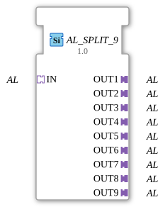

# AL_SPLIT_9


* * * * * * * * * *
## Introduction
The function block **AL_SPLIT_9** is a generic function block that splits an incoming adapter of type `AL` into nine identical outgoing adapters. It is used to distribute a signal or data flow arriving via a single adapter to multiple downstream components. The function block is defined as a generic type (`GEN_AL_SPLIT`) and must be bound to the specific adapter type before use.
## Interface Structure

### **Event Inputs**

The function block has no event inputs. Data is passed exclusively via adapter connections.

### **Event Outputs**

There are no event outputs.

### **Data Inputs**

No separate data inputs – the actual data is transmitted via the incoming adapter.

### **Data Outputs**

No separate data outputs – the output data is provided via the nine outgoing adapters.

### **Adapters**

| Direction | Name | Type | Description |

|----------|------|-----|--------------|

| **Socket** (Input) | `IN` | `adapter::types::unidirectional::AL` | An incoming adapter that provides the signal or data to be distributed. |

| **Plug** (Output) | `OUT1` … `OUT9` | `adapter::types::unidirectional::AL` | Nine outgoing adapters, each outputting a copy of the input signal. |

## Functionality

The function block acts as a passive distributor. As soon as the incoming adapter `IN` receives a signal or data packet, the function block forwards it to all nine output adapters (`OUT1` … `OUT9`). This forwarding occurs without buffering or delay – it is a pure 1:9 distribution.

Since the function block is generic, a specific adapter type must be assigned to it before use. This is done in the development environment by specifying the adapter type, which defines the actual data fields and events.

```
## Technical Features

- **Generic Function Block:** The function block is declared as `GEN_AL_SPLIT` and requires binding to a specific `AL` adapter type (e.g., `SimpleData_AL`). The binding is controlled by the attribute `eclipse4diac::core::GenericClassName`.
- **Type Safety:** All nine outputs use the same adapter type as the input. This ensures that the data structure remains identical.
- **Stateless:** The function block has no internal states or memory – distribution occurs instantaneously with each new data iteration.
- **No Event Control:** Since no event inputs are defined, distribution is triggered solely by data changes at the input adapter.

## State Overview

The function block has no internal state machine. It operates statelessly and is purely data-flow driven.

## Application Scenarios
- **Signal Distribution:** A sensor value (e.g., temperature, pressure) is to be sent simultaneously to multiple evaluation units or controllers.
- **Data Replication:** A control command is to be distributed to multiple actuators in parallel.
- **Modular Architectures:** Splitting a data stream in a pipeline to feed different processing branches.

## Comparison with Similar Components
- **AL_SPLIT_2, AL_SPLIT_4:** Components with analog functionality that distribute the input signal to 2 or 4 outputs, respectively. `AL_SPLIT_9` covers a larger number of outputs, which is particularly useful in complex distribution structures.
- **Simple Coupling (e.g., Direct Connection):** Without the Split component, the sender would have to provide multiple adapter connections themselves. The Split component encapsulates this logic and simplifies the overall architecture.

**AL_SPLIT_2, AL_SPLIT_4:** Components with analog functionality that distribute the input signal to 2 or 4 outputs, respectively. `AL_SPLIT_9` covers a larger number of outputs, which is particularly useful in complex distribution structures.

**Simple Coupling (e.g., Direct Connection):** Without the Split component, the sender would have to provide multiple adapter connections themselves. The Split component encapsulates this logic and simplifies the overall architecture.

**
## Conclusion

The `AL_SPLIT_9` is a simple yet powerful generic distribution block for adapter interfaces of type `AL`. It enables clean, maintainable distribution of a data flow across nine independent paths. Thanks to its generic nature and stateless operation, it is ideally suited for modular and scalable automation solutions.

---

### 🌐 Related topic subpages on ms-muc-docs.de
* [🌐 Eclipse 4diac IDE & color reference on ms-muc-docs.de ](https://www.ms-muc-docs.de/iec-61499/eclipse-4diac/)
