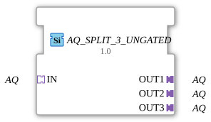

# AQ_SPLIT_3_UNGATED

> ℹ️ **UNGATED variant:** This block is the ungated version of [`AQ_SPLIT_3`](AQ_SPLIT_3.md). It suppresses **no** unchanged repeats – every newly computed result is forwarded unconditionally, even without a value change. This matters for consumers that need a periodic cadence regardless of value change (e.g. derivative/frequency calculations that would otherwise fail to decay toward zero). Any change-detection/gating statements further down this page do **not** apply to this block.

* * * * * * * * * *

## Introduction

The function block `AQ_SPLIT_3_UNGATED` implements a 1-to-3 split (fan-out) of a unidirectional AQ adapter signal. An incoming AQ adapter signal is copied to three identical output adapters and made available in parallel.

## Interface Structure

### **Event Inputs**

None.

### **Event Outputs**

None.

### **Data Inputs**

None.

### **Data Outputs**

None.

### **Adapters**

**Socket (Input)**

| Name | Type | Description |
|-------------|------------------------------------------|--------------|
| `IN` | `adapter::types::unidirectional::AQ` | Input adapter whose signal is distributed to three outputs |

**Plug (Outputs)**

| Name | Type | Description |
| ------------- | ------------------------------------------- | -------------- |
| `OUT1` | `adapter::types::unidirectional::AQ` | First output (copy of the input signal) |
| `OUT2` | `adapter::types::unidirectional::AQ` | Second Output (Copy of Input Signal) |
| `OUT3` | `adapter::types::unidirectional::AQ` | Third Output (Copy of Input Signal) |

## Functionality

The module forwards the AQ signal present at socket `IN` to all three plugs (`OUT1`, `OUT2`, `OUT3`) without delay or data manipulation. This is a pure signal distribution (fan-out) – the incoming adapter interface is mirrored to three identical output interfaces. Since no events or data outside the adapter are processed, the forwarding is passive and transparent.

## Technical Features

- **Generic Type**: The function block uses the attribute `eclipse4diac::core::GenericClassName` with the value `'GEN_AQ_SPLIT'`. This allows it to be used as a generic AQ splitter in various contexts.
- **Unidirectional**: The adapters are defined as unidirectional AQ interfaces – data flows only from the input to the outputs.
- **No State Logic**: The function block has no event I/O, no internal state, and no data I/O. It functions purely as connection logic.

## State Overview

The function block is stateless. It does not execute any time-dependent or sequential processes. The output signals always directly correspond to the current input signal.

## Application Scenarios

- **Signal Distribution in Automation**: When an AQ signal (e.g., a quality value, a measurement, or status adapter) needs to be simultaneously distributed to multiple consumers.
- **Multicasting of Adapters**: In architectures where a service sends its result to multiple downstream components via an AQ adapter.
- **Generic Coupling**: Used as a generic splitter in libraries or frameworks based on the `GEN_AQ_SPLIT` type.

## Comparison with Similar Components

- **AQ_SPLIT_2**: Distributes to only two outputs – `AQ_SPLIT_3_UNGATED` offers an additional third output.
- **Manual Triple Wiring**: Instead of a single component, the input signal could be manually connected to three sockets. However, the splitter improves the clarity and maintainability of the network.
- **Generic Splitters for Other Adapter Types**: Similar components exist, for example, for data or event signals (e.g., `DATA_SPLIT_3`). `AQ_SPLIT_3_UNGATED` is specifically designed for the AQ adapter type.

## Change Detection

This block performs **no** change detection. Every newly computed result is written to the output and its adapter event fired unconditionally, regardless of whether the value differs from the previous run.

## Conclusion

AQ_SPLIT_3_UNGATED` is a simple, functional fan-out component for unidirectional AQ adapters. Thanks to its generic design and clear 1:3 distribution, it is ideally suited for all applications that need to provide an AQ signal multiple times. The absence of event and data I/O makes it lightweight and usable in any process context.

---

### 🌐 Related topic subpages on ms-muc-docs.de

- [🌐 Eclipse 4diac IDE & Color Reference on ms-muc-docs.de](https://www.ms-muc-docs.de/iec-61499/eclipse-4diac/)

]
