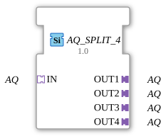

# AQ_SPLIT_4

* * * * * * * * * *
## Introduction
The function block `AQ_SPLIT_4` serves as a fan-out component for distributing an incoming AQ adapter to four identical output adapters. It is used to forward an analog signal or control variable (AQ – Analog Quantity) from a sender to multiple independent receivers without compromising signal integrity.
## Interface Structure
### **Event Inputs**
No event inputs available.

### **Event Outputs**
No event outputs available.

### **Data Inputs**
No data inputs available.

### **Data Outputs**
No data outputs available.

### **Adapters**

| Type | Direction | Name | Description |

|-----|----------|------|--------------|

| `adapter::types::unidirectional::AQ` | Socket (Input) | `IN` | Incoming AQ adapter, which is distributed to the four outputs. |

| `adapter::types::unidirectional::AQ` | Plug (Output) | `OUT1` | First outgoing AQ adapter. |

| `adapter::types::unidirectional::AQ` | Plug (Output) | `OUT2` | Second outgoing AQ adapter. |

| `adapter::types::unidirectional::AQ` | Plug (Output) | `OUT3` | Third outgoing AQ adapter. |

| `adapter::types::unidirectional::AQ` | Plug (Output) | `OUT4` | Fourth outgoing AQ adapter. |

## Functionality
The `AQ_SPLIT_4` forwards all data and events arriving via socket `IN` from the AQ adapter unchanged to the four plug adapters `OUT1` to `OUT4`. No processing, filtering, or delay of the signals takes place. Distribution occurs purely at the connection level, so all outputs always have the same state as the input.

# Functionality
## Technical Features
- **Generic Typing**: The function block uses the attribute `eclipse4diac::core::GenericClassName` with the value `'GEN_AQ_SPLIT'`. This allows it to be addressed as a generic function block in the 4diac IDE, increasing its reusability in various application contexts.
- **No State Logic**: The function block has no internal state machine (ECC) and no input/output events. It acts purely as a "wiring aid" for adapter connections.
- **Unidirectional Adapter**: All adapters used are of type `unidirectional::AQ`, meaning data flows only in one direction (from the socket to the plugs).

## State Overview

The function block has no state machine. It is passive and does not perform any time- or event-driven operations. Signal transmission is continuous and without intermediate storage.

## Application Scenarios
- **Distributing a Measured Value**: An analog sensor (e.g., temperature, pressure, flow rate) is connected via an AQ adapter and its signal needs to be sent to multiple control or monitoring units.
- **Multiple Use of a Control Signal**: An analog control signal output by a controller is transmitted in parallel to multiple actuators (e.g., valves, frequency converters).
- **Signal Monitoring**: The original signal is sent unchanged to the end devices, while an additional output is used for diagnostics or logging.

## Comparison with Similar Function Blocks
- **AQ_SPLIT_2**: Distributes an AQ signal to two outputs instead of four – saving space and reducing requirements.
- **IQ_SPLIT_4**: Analog function block for digital adapters (e.g., `adapter::types::unidirectional::IQ`), otherwise identical functionality.
- **Manual Parallel Connection**: Theoretically, one could manually connect an AQ socket to multiple plugs, but the `AQ_SPLIT_4` offers a clear and reusable encapsulation.

## Conclusion
The `AQ_SPLIT_4` is a simple yet useful function block for signal distribution in industrial automation with 4diac. Its generic design and lack of internal logic make it easy to understand, robust, and flexible. It contributes to the structuring and reusability of function block networks.

---

### 🌐 Related topic subpages on ms-muc-docs.de
* [🌐 Eclipse 4diac IDE & Color Reference on ms-muc-docs.de](https://www.ms-muc-docs.de/iec-61499/eclipse-4diac/)
* [🌐 Total resistance in series & parallel circuits on ms-muc-docs.de](https://www.ms-muc-docs.de/elektrotechnik/elektrik/widerstand/widerstand-theorie/gesamtwiderstand-reihen-parallelschaltung/)

]
