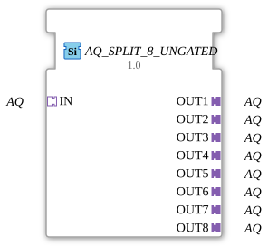

# AQ_SPLIT_8_UNGATED

> ℹ️ **UNGATED variant:** This block is the ungated version of [`AQ_SPLIT_8`](AQ_SPLIT_8.md). It suppresses **no** unchanged repeats – every newly computed result is forwarded unconditionally, even without a value change. This matters for consumers that need a periodic cadence regardless of value change (e.g. derivative/frequency calculations that would otherwise fail to decay toward zero). Any change-detection/gating statements further down this page do **not** apply to this block.

* * * * * * * * * *

## Introduction

The function block **AQ_SPLIT_8_UNGATED** is a fan-out function block that distributes a single AQ adapter input to eight identical AQ adapter outputs. It serves to multiply signals in analog output paths, thus enabling the parallel control of multiple identical actuators or subsystems. The implementation is based on the generic mechanism `GEN_AQ_SPLIT` and is designed for unidirectional AQ interfaces.

## Interface Structure

### **Event Inputs**

None – the function block operates purely on an adapter basis without event control.

## **Event Outputs**

None – the function block has no event outputs.

## **Data Inputs**

None – all signal transmission occurs via AQ adapters.

### **Data Outputs**

None – see Data Inputs.

### **Adapters**

| Adapter | Type | Direction | Description |
| --------- | ----- | ---------- | -------------- |
| **IN** | `adapter::types::unidirectional::AQ` | Socket (Input) | Receives the AQ signal to be distributed. |
| **OUT1** – **OUT8** | `adapter::types::unidirectional::AQ` | Plug (Output) | Identical outputs that forward the signal from `IN`. |

## Functionality

The module forwards the AQ signal present at socket `IN` to all eight plug outputs `OUT1` to `OUT8` via internal wiring. No signal processing or modification takes place – it is a simple 1:8 distribution (fan-out). The adapters are unidirectional, meaning data and events flow only from the input to the outputs.

## Technical Features

- **No Clocked Logic**: The module does not require event I/Os, as the forwarding occurs directly via the adapter interface level.
- **Generic Type**: The module is declared as a generic instance (`GEN_AQ_SPLIT`) – the specific adapter type can be adapted depending on the system environment.
- **Expandability**: The 8 outputs are hardwired; dynamic numbering or configuration is not supported.

## State Overview

The module does not have an explicit state machine (ECC). Its functionality is purely static: As soon as the `IN` adapter is active, all outputs output the same signal. There are no operating modes, error states, or lifecycle events.

## Application Scenarios

- **Parallel Wiring**: Distribute an analog output signal simultaneously to multiple actuators or measuring points.
- **Test and Simulation Environments**: A signal generator feeds the signal via `IN`, and multiple simulated components are supplied via `OUT1`–`OUT8`.
- **Redundant Control**: For situations where multiple subsystems need to receive the same setpoint without requiring a bus or software branching.

## Comparison with Similar Components

- **AQ_SPLIT_4**: Offers only 4 outputs – suitable for lower distribution requirements.
- **AQ_SELECT**: A multiplexer that selects one input from multiple inputs – the opposite of a split function.
- **DQ_SPLIT_8**: Analog component for digital signals (DQ type) – structurally identical, but for a different signal type.

## Change Detection

This block performs **no** change detection. Every newly computed result is written to the output and its adapter event fired unconditionally, regardless of whether the value differs from the previous run.

## Conclusion

The **AQ_SPLIT_8_UNGATED** is a simple, reliable fan-out component for the 1:8 distribution of analog output signals via adapter interfaces. It does not use event logic or state machines and is therefore particularly suitable for clearly defined, static signal distributions in automation systems. Its generic basis facilitates reuse in different projects.
