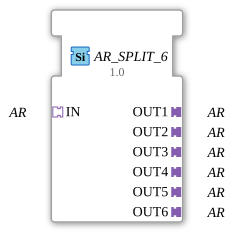

# AR_SPLIT_6

* * * * * * * * * *
## Introduction
The function block **AR_SPLIT_6** is used to distribute a single AR adapter input to six separate AR adapter outputs. It is designed as a generic function block (Generic FB) and allows for the simple duplication of an AR interface without data loss or protocol-specific conversion.
## Interface Structure

### **Event Inputs**

No event inputs are available. Functionality is controlled solely via the adapter interface.

### **Event Outputs**

No event outputs are available.

### **Data Inputs**

No data inputs are available.

### **Data Outputs**

No data outputs are available.

### **Adapter**

| Type | Name | Direction | Description |

|-----|------|----------|-------------|

| `adapter::types::unidirectional::AR` | **IN** | Socket (Input) | An incoming AR adapter that is distributed to all outputs. |

| `adapter::types::unidirectional::AR` | **OUT1** | Plug (Output) | First outgoing AR adapter (identical to IN). |

| `adapter::types::unidirectional::AR` | **OUT2** | Plug (Output) | Second outgoing AR adapter (identical to IN). |

| `adapter::types::unidirectional::AR` | **OUT3** | Plug (Output) | Third outgoing AR adapter (identical to IN). |

| `adapter::types::unidirectional::AR` | **OUT4** | Plug (Output) | Fourth outgoing AR adapter (identical to IN). |

| `adapter::types::unidirectional::AR` | **OUT5** | Plug (Output) | Fifth outgoing AR adapter (identical to IN). |

| `adapter::types::unidirectional::AR` | **OUT6** | Plug (Output) | Sixth outgoing AR adapter (identical to IN). |

## Functionality

The function block forwards the signals from the incoming AR adapter (socket **IN**) unchanged to all six output adapters (**OUT1** … **OUT6**). No logical or timing processing takes place – any change at the input is immediately visible on all outputs. The function block operates purely passively and does not require event control.

## Functionality ## Technical Features
- **Generic Function Block (FB):** The FB is declared as a generic type (`eclipse4diac::core::GenericClassName = 'GEN_AR_SPLIT'`), allowing it to be reused in different contexts without having to redefine the underlying AR type.
- **Unidirectional Adapters:** All adapters used are of type `adapter::types::unidirectional::AR`, meaning data flows only from the socket to the plugs.
- **No State Machine:** Since the FB has no events or internal logic, there is no ECC (Execution Control Chart).

## State Overview

This FB does not contain a state machine. It operates in a data-driven manner and establishes the input/output relationship continuously and without delay.

## Application Scenarios
- **Distributing an AR signal to multiple devices:** If a sensor or actuator provides its data via an AR adapter, this function block (FB) can supply multiple downstream modules in parallel (e.g., several controllers or displays).
- **Test and simulation environments:** This FB is suitable for switching a single test signal to multiple evaluation units simultaneously.
- **Redundancy or parallelization:** In controllers that require multiple identical processing chains, the input is simply duplicated.

## Comparison with similar function blocks
- **AR_SPLIT_2 / AR_SPLIT_4:** These function blocks split the input into two or four outputs, respectively, and differ only in the number of outputs. AR_SPLIT_6 extends this to six outputs.
- **General split function blocks:** Other split function blocks exist for data types (e.g., INT_SPLIT), but these are designed for specific data formats. This function block operates exclusively at the adapter level, making it more flexible when data exchange occurs via adapters.
- **Custom Implementation:** Alternatively, the distribution could also be achieved by manually wiring multiple adapter nodes, but this reduces clarity and maintainability.

## Conclusion

The **AR_SPLIT_6** is a simple yet useful generic function block for multiplying an AR adapter signal into six parallel outputs. It is characterized by minimal complexity, a clear structure, and high reusability in automation projects based on the 4diac IDE and the IEC 61499 standard.

--

### 🌐 Related topic subpages on ms-muc-docs.de
* [🌐 Eclipse 4diac IDE & Color Reference on ms-muc-docs.de](https://www.ms-muc-docs.de/iec-61499/eclipse-4diac/)
