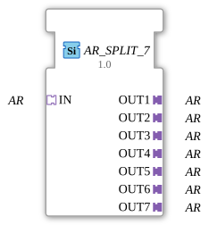

# AR_SPLIT_7

* * * * * * * * * *
## Introduction
The **AR_SPLIT_7** is a generic function block that distributes an incoming AR adapter socket (of type `adapter::types::unidirectional::AR`) to seven separate AR adapter plugs. It serves to forward an AR signal to up to seven different receivers without requiring the data to be provided multiple times.

## Interface Structure
### **Event Inputs**
None.

### **Event Outputs**
None.

### **Data Inputs**
None.

### **Data Outputs**
None.

### **Adapter**

| Type | Name | Direction | Description |

|-----|------|----------|--------------|

| `adapter::types::unidirectional::AR` | IN | Socket | Incoming AR adapter, which is distributed to the seven outputs. |

| `adapter::types::unidirectional::AR` | OUT1 … OUT7 | Plug | Seven output adapters to which the incoming AR adapter is passed on unchanged. |

## Functionality
The function block receives an AR adapter via socket `IN`. As soon as a connection to this socket is established, the function block forwards the complete adapter – including all data and events it contains – to all seven plug adapters (`OUT1` to `OUT7`). No data transformation, filtering, or buffering takes place; the AR adapter is mirrored **1:1 across all outputs**.

The function block (FB) is implemented as a **generic block** (see attribute `eclipse4diac::core::GenericClassName = 'GEN_AR_SPLIT'`), so it operates independently of the specific AR adapter parameters.

## Technical Features

- **Generic Design** – The FB does not require specific type information from the AR adapter; it operates purely via the adapter interface.

- **No State Machine** – The FB does not have an ECC (Execution Control Chart) and is purely data flow-related; it reacts directly to adapter connections.

- **Copyright & License** – The function block is subject to the Eclipse Public License 2.0 (EPL-2.0) and was provided by HR Agrartechnik GmbH (Version 1.0, 2025-01-24).

## State Overview
The function block (FB) does not have a state machine (ECC). Distribution is static and without runtime logic.

## Application Scenarios

- **Signal Distribution in Automation Systems** – One sensor or control adapter (AR) must supply several downstream function blocks in parallel.

- **Monitor or Diagnostic Connection** – An AR signal is simultaneously passed on to a control branch and a monitoring branch.

- **Test and Simulation Environments** – One adapter is distributed to several test or mock function blocks without instantiating the source multiple times.

## Comparison with Similar Function Blocks

- **AR_SPLIT_2, AR_SPLIT_3, …** – These function blocks offer the same functionality with a different number of outputs (2, 3, …). The `AR_SPLIT_7` is the variant with exactly seven outputs.

- **AR_MERGE** – Merging multiple AR adapters into one, i.e., the inverse operation.

- **AR_COPY** – Often used as a dedicated function block for a single 1:1 distribution, while `AR_SPLIT_7` handles multiple outputs at once.

## Conclusion
The **AR_SPLIT_7** is a lean, generic function block for easily distributing one AR adapter to up to seven target adapters. Thanks to its generic nature, it can be used immediately without modifying the type information and is particularly suitable for loosely coupled, dataflow-oriented architectures in automation technology.

---

### 🌐 Related topic subpages on ms-muc-docs.de

* [🌐 Eclipse 4diac IDE & color reference on ms-muc-docs.de](https://www.ms-muc-docs.de/iec-61499/eclipse-4diac/)

]