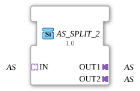

# AS_SPLIT_2

* * * * * * * * * *
## Introduction
The function block **AS_SPLIT_2** splits an incoming adapter signal of type `adapter::types::unidirectional::AS` into two identical output adapters. It is designed as a generic function block and is suitable for applications where an adapter data stream needs to be distributed to multiple downstream components without altering the original signal.
## Interface Structure

### **Event Inputs**

None. The function block operates purely data-driven via the adapters.

### **Event Outputs**

None.

### **Data Inputs**

None. All data transmission occurs via the adapter input `IN`.

### **Data Outputs**

None. The output data is provided via the adapters `OUT1` and `OUT2`.

### **Adapters**

| Direction | Name | Type | Description |
|----------|------|-----|--------------|
| Socket | `IN` | `adapter::types::unidirectional::AS` | Input adapter whose data is distributed to both outputs. |
| Plug | `OUT1` | `adapter::types::unidirectional::AS` | First output adapter – receives a copy of the incoming data. |
| Plug | `OUT2` | `adapter::types::unidirectional::AS` | Second output adapter – also receives a copy of the incoming data. |

## Functionality

The module functions as a passive distributor: An adapter data stream present at socket `IN` is forwarded unchanged to both plugs `OUT1` and `OUT2`. No data manipulation, buffering, or filtering takes place. The distribution is signal-accurate, so the data present at `OUT1` and `OUT2` corresponds exactly in time and content to the data at `IN`.

## Technical Features
- **Generic Type:** The module is declared as a generic function block (`GenericClassName = GEN_AS_SPLIT`). This allows for use in various contexts, provided the connected adapters are of type `AS`.
- **No Event Control:** Data flows solely through the adapter interfaces. There are no event inputs or outputs, meaning the module has no independent sequence control.
- **No Data Buffer:** Since neither memory nor delay is implemented, the module is particularly suitable for low-latency, real-time applications.

## State Overview

The module has no internal states or sequential logic. It behaves like a pure wiring component and operates continuously without an explicit state machine.

## Application Scenarios
- **Signal Fan-out:** Distributing a sensor adapter to multiple evaluation units connected in parallel.
- **Redundancy:** Feeding a control signal into two independent actuator circuits.
- **Monitoring:** Connecting an analysis or logging adapter in parallel to the existing data path.

## Comparison with Similar Function Blocks

Unlike a simple connection node (which only implements a 1:1 connection), `AS_SPLIT_2` enables clean, configurable distribution across two outputs. Compared to an **AS_MUX** or **AS_DEMUX**, this function block lacks selection or prioritization logic – it always distributes all incoming data to all outputs. Similar blocks like `AS_SPLIT_3` or `AS_SPLIT_N` expand the number of outputs accordingly.

## Conclusion

The **AS_SPLIT_2** is a simple yet useful function block for duplicating adapter data streams. Its generic definition and the absence of complex logic make it ideally suited as a universal distribution element in 4diac-based automation systems where signal splitting without data modification is required.

---

### 🌐 Related topic subpages on ms-muc-docs.de
* [🌐 Eclipse 4diac IDE & Color Reference on ms-muc-docs.de](https://www.ms-muc-docs.de/iec-61499/eclipse-4diac/)
