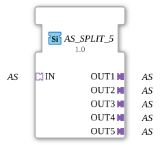

# AS_SPLIT_5

* * * * * * * * * *
## Introduction
The AS_SPLIT_5 function block is a generic function block that distributes one incoming adapter of type "AS" (unidirectional) to five separate output adapters of the same type. It is used for signal multiplication in control and automation systems, based on the IEC 61499-2 standard.
## Interface Structure

### **Event Inputs**
No event inputs defined.

### **Event Outputs**
No event outputs defined.

### **Data Inputs**
No data inputs defined.

### **Data Outputs**
No data outputs defined.

### **Adapters**

| Role | Name | Type | Description |

|-------|------|-----|--------------|

Socket | IN | adapter::types::unidirectional::AS | Input adapter that receives the AS signal to be distributed. |

Plug | OUT1 | adapter::types::unidirectional::AS | First output adapter for the distributed signal. |

Plug | OUT2 | adapter::types::unidirectional::AS | Second output adapter. |

Plug | OUT3 | adapter::types::unidirectional::AS | Third output adapter. |

Plug | OUT4 | adapter::types::unidirectional::AS | Fourth output adapter. |

Plug | OUT5 | adapter::types::unidirectional::AS | Fifth output adapter. |

## Functionality

The AS_SPLIT_5 block functions as a passive distributor. The AS signal present at socket "IN" is forwarded identically to all five output plugs (OUT1 to OUT5) without delay or modification. Distribution strictly follows the broadcast principle – each outgoing signal corresponds to the original signal. The implementation is purely adapter-based and requires no additional event or data port connections.

## Technical Features
- The block is defined as a generic type (GenericClassName = 'GEN_AS_SPLIT') and can therefore be parameterized using the 4diac IDE.
- A type hash is used to ensure the block's uniqueness within the project.
- The number of outputs is fixed at five; dynamic configuration is not supported.
- The runtime environment must support the unidirectional adapter interface "adapter::types::unidirectional::AS".

## State Overview

The block does not have an internal state machine. Signal distribution is continuous and without sequential logic. Therefore, a status overview is not required.

## Application Scenarios
- **Control Wiring**: Splitting an AS signal from a higher-level controller to multiple substations or actuators.
- **Simulation and Testing**: Multiplying a test signal for parallel control of multiple simulated components.
- **Redundancy**: Providing the same signal on different paths to enable redundancy or load balancing.

## Comparison with Similar Components

Since AS_SPLIT_5 is designed for a specific adapter architecture (unidirectional AS), similar components typically exist, such as "AS_SPLIT_2", "AS_SPLIT_3", or generalized splitters with a variable number of outputs. This component differs in its fixed number of five outputs and its pure adapter interface without data or event ports.

## Conclusion

The AS_SPLIT_5 is a simple yet effective function block for multiplying an AS adapter signal into five parallel outputs. Its generic implementation and clear interface make it well-suited for modular automation solutions according to IEC 61499.

---

### 🌐 Related topic subpages on ms-muc-docs.de
* [🌐 Eclipse 4diac IDE & color reference on ms-muc-docs.de](https://www.ms-muc-docs.de/iec-61499/eclipse-4diac/)

]