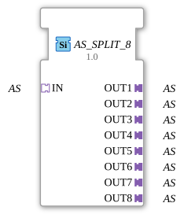

# AS_SPLIT_8

* * * * * * * * * *

## Introduction

The function block **AS_SPLIT_8** is used to split an incoming *Application Specific* (AS) adapter data stream into eight identical outputs. It is provided as a generic function block (generic FB) and is specifically designed for distributing adapter data within an IEC 61499-based control application.

## Interface Structure

### **Event Inputs**

None.

### **Event Outputs**

None.

### **Data Inputs**

None.

### **Data Outputs**

None.

### **Adapter**

| Type | Name | Direction | Description |
| --- | --- | --- | --- |
| adapter::types::unidirectional::AS` | IN | Socket (Input) | Receives the AS data stream to be distributed. |
| adapter::types::unidirectional::AS` | OUT1 | Plug (Output) | First copy of the incoming AS data stream. |
| adapter::types::unidirectional::AS` | OUT2 | Plug (Output) | Second copy of the incoming AS data stream. |
| adapter::types::unidirectional::AS` | OUT3 | Plug (Output) | Third copy. |
| adapter::types::unidirectional::AS` | OUT4 | Plug (Output) | Fourth copy. |
| adapter::types::unidirectional::AS` | OUT5 | Plug (Output) | Fifth copy. |
| adapter::types::unidirectional::AS` | OUT6 | Plug (Output) | Sixth Copy. |
| `adapter::types::unidirectional::AS` | OUT7 | Plug (Output) | Seventh Copy. |
| `adapter::types::unidirectional::AS` | OUT8 | Plug (Output) | Eighth Copy. |

## Functionality

The module operates purely on an adapter basis, without using events or data inputs/outputs. The adapter data stream present at socket `IN` is internally mirrored to all eight output plugs (`OUT1` … `OUT8`). Each output passes on exactly the same data that is present at the input. No delay, filtering, or modification takes place. Branching occurs passively and without active runtime logic (no state machine).

## Technical Features

- **Pure Adapter Block**: The function block (FB) has neither event nor data interfaces in the traditional sense; all data transmission occurs via the adapter connections.
- **Generic Implementation**: By declaring it as a generic FB (`GenericClassName = 'GEN_AS_SPLIT'`), the block can be used for any AS adapter type, provided the underlying adapter type is `unidirectional::AS`.
- **No State Machine**: Due to the lack of events, an Execution Control Chart (ECC) is not required. Distribution is continuous.
- **Simple 1:8 Splitting**: Optimized for situations where a signal needs to be distributed to multiple subsequent modules.

## State Overview

Not applicable – the block has no internal states or sequence control.

## Application Scenarios

- **Parallel Distribution of Sensor Data**: A single adapter that... B. If a tank's fill level data is provided, it is distributed across eight monitoring or controlling functional units.
- **Signal Multicasting in Industry 4.0**: Distribution of a control command to multiple actuators or subsystems.
- **Test Environments** for simulating multiple receivers of a data stream.

## Comparison with Similar Function Blocks

- **AS_SPLIT_2 / AS_SPLIT_4**: Analog function blocks with fewer outputs. AS_SPLIT_8 offers maximum distribution in one step with eight outputs.
- **Event-based splitters (e.g., E_SPLIT)**: These operate with events and distribute them according to a time-controlled process. In contrast, this function block continuously distributes all adapter data without event control.
- **Data-based splitters (e.g., ANY_DISTRIBUTE)**: Split data values but require additional events. AS_SPLIT_8 is optimized for simple adapter forwarding.

## Change Detection

Each output plug is updated independently: the incoming value is written to a given output, and its adapter event sent, only if it differs from that output's current value. Outputs that are already in sync stay quiet, while an output that was just connected (or has drifted out of sync) still receives the update it needs.

## Conclusion

The **AS_SPLIT_8** is a simple yet useful adapter distributor that duplicates an incoming AS data stream to eight outputs without requiring any additional logic. Its generic nature and clear structure make it a robust solution for scenarios where an adapter signal needs to be used multiple times. The module's documentation does not claim to be exhaustive regarding implementation details; the exact functionality may vary depending on the runtime environment used.
