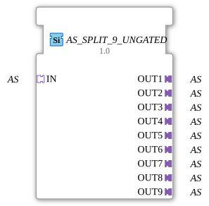

# AS_SPLIT_9_UNGATED

> ℹ️ **UNGATED variant:** This block is the ungated version of [`AS_SPLIT_9`](AS_SPLIT_9.md). It suppresses **no** unchanged repeats – every newly computed result is forwarded unconditionally, even without a value change. This matters for consumers that need a periodic cadence regardless of value change (e.g. derivative/frequency calculations that would otherwise fail to decay toward zero). Any change-detection/gating statements further down this page do **not** apply to this block.

* * * * * * * * * *

## Introduction

The function block **AS_SPLIT_9_UNGATED** is used to split an incoming **AS adapter** (unidirectional) into nine separate output adapters. It is implemented as a generic function block and distributes the AS signal present at socket `IN` identically to all nine plug outputs (`OUT1` … `OUT9`). This makes it ideal for routing a single AS signal multiple times to different downstream components.

## Interface Structure

### **Event Inputs**

- None

### **Event Outputs**

- None

### **Data Inputs**

- None

### **Data Outputs**

- None

### **Adapters**

| Direction | Name | Type | Description |
| ---------- | ----- | ----- | -------------- |
| **Socket** | `IN` | `adapter::types::unidirectional::AS` | Input Adapter (AS Interface) |
| **Plug** | `OUT1` | `adapter::types::unidirectional::AS` | First Output Adapter |
| **Plug** | `OUT2` | `adapter::types::unidirectional::AS` | Second Output Adapter |
| **Plug** | `OUT3` | `adapter::types::unidirectional::AS` | Third Output Adapter |
| **Plug** | `OUT4` | `adapter::types::unidirectional::AS` | Fourth Output Adapter |
| **Plug** | `OUT5` | `adapter::types::unidirectional::AS` | Fifth Output Adapter |
| **Plug** | `OUT6` | `adapter::types::unidirectional::AS` | Sixth Output Adapter |
| **Plug** | `OUT7` | `adapter::types::unidirectional::AS` | Seventh Output Adapter |
| **Plug** | `OUT8` | `adapter::types::unidirectional::AS` | Eighth Output Adapter |
| **Plug** | `OUT9` | `adapter::types::unidirectional::AS` | Ninth Output Adapter |

## Functionality

The module receives an AS connection via socket `IN`. Internal logic forwards this incoming signal without modification to all nine plug outputs (`OUT1` … `OUT9`). This ensures that the same AS data and/or events are always available at all outputs. There is no separate state machine or internal processing – distribution occurs directly and without delay.

## Technical Features

- **Generic Function Block** – The function block is classified as **GEN_AS_SPLIT** and can be parameterized as needed (e.g., for a variable number of outputs).
- **Unidirectional Adapters** – Both inputs and outputs use the type `adapter::types::unidirectional::AS`. This ensures that the data/event direction from IN to OUT is strictly maintained.
- No dedicated event or data inputs are required – the entire interface consists exclusively of adapters.

## State Overview

The function block does not have an explicit state machine (ECC). Distribution occurs purely combinatorially as soon as the input adapter provides valid data or events.

## Application Scenarios

- **Signal Distribution** – An AS sensor or controller must supply several actuators or monitored components simultaneously.
- **Parallel Operation** – Multiple devices are to be connected to an AS network without requiring active replication.
- **Test and Simulation Environments** – An outgoing AS signal is split across multiple test modules or analysis tools.

## Comparison with Similar Components

- **AS_SPLIT_2**, **AS_SPLIT_4**, etc. – These components offer a smaller number of outputs (2, 4, etc.) and are optimized for smaller distributions.
- **AS_MUX** – A multiplexer that combines multiple inputs into one output; the opposite of a splitter.
- **AS_COPY** – Copies a signal to a second output; equivalent to a 1:2 split.
- **AS_SPLIT_9_UNGATED**, with nine outputs, is the largest standard variant and covers extensive distribution requirements.

## Change Detection

This block performs **no** change detection. Every newly computed result is written to the output and its adapter event fired unconditionally, regardless of whether the value differs from the previous run.

## Conclusion

The **AS_SPLIT_9_UNGATED** is a straightforward, reliable function block for duplicating an AS signal. Its simple adapter interface and lack of internal logic make it particularly suitable for applications where an output signal needs to be distributed to multiple receivers. Its generic nature also allows for easy adaptation to specific project requirements.
