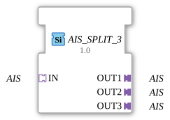

# AIS_SPLIT_3

* * * * * * * * * *

## Introduction

The function block **AIS_SPLIT_3** is used to distribute an incoming AIS data stream to three identical outputs. It is implemented as a generic function block and enables the simple duplication of AIS information in control systems according to IEC 61499.

## Interface Structure

### **Event Inputs**

Not present – the function block operates purely data- and adapter-driven.

### **Event Outputs**

Not present.

### **Data Inputs**

Not present – input data is provided exclusively via the adapter socket.

### **Data Outputs**

Not present – output data is provided exclusively via the adapter plugs.

### **Adapter**

| Type | Name | Direction | Description |
| ----- | ------ | ---------- | -------------- |
| `adapter::types::unidirectional::AIS` | IN | Socket (Input) | Receives an AIS data stream. |
| `adapter::types::unidirectional::AIS` | OUT1 | Plug (Output) | First output channel – identical copy of the input. |
| `adapter::types::unidirectional::AIS` | OUT2 | Plug (Output) | Second output channel – identical copy of the input. |
| `adapter::types::unidirectional::AIS` | OUT3 | Plug (Output) | Third output channel – identical copy of the input. |

## Functionality

The module receives an AIS data stream via the **IN** socket and forwards it without delay or manipulation to the three output adapters **OUT1**, **OUT2**, and **OUT3**. Each output receives identical data. No buffering, filtering, or protocol conversion takes place – the module functions purely as a splitter at the adapter level.

## Technical Features

- **Generic Type**: The module is assigned the generic class name `GEN_AIS_SPLIT`, allowing it to be reused in various contexts and with different AIS data types.
- **Unidirectional Adapters**: Both inputs and outputs use the unidirectional adapter `adapter::types::unidirectional::AIS`, ensuring a clear data flow direction.
- **No Event-Driven Synchronization**: Since there are no event inputs/outputs, data transmission occurs immediately and without triggering by external events.

## State Overview

This function block does not have an explicit state machine. Its behavior is that of a continuously active pass-through connection: As long as the input adapter is supplying data, it is output on all three outputs. There are no internal states or modes.

## Application Scenarios

- **Distributing AIS data to multiple consumers** – e.g., simultaneous visualization, logging, and further processing.
- **Redundant data provision** – feeding data into different subsystems without placing an additional load on the data source.
- **Test and diagnostic setups** – parallel monitoring of an AIS stream at multiple points.

## Comparison with similar function blocks

| Function block | Number of outputs | Special feature |
| ---------- | ------------------ | -------------- |
| AIS_SPLIT_2 | 2 | Distributed across two channels. |
| **AIS_SPLIT_3** | **3** | **Standard splitter with three outputs.** |
| AIS_SPLIT_N | variable | Generic version with configurable number of outputs (where available). |

The AIS_SPLIT_3 fills the gap between a simple 2-way splitter and a fully configurable splitter.

## Change Detection

Each output plug is updated independently: the incoming value is written to a given output, and its adapter event sent, only if it differs from that output's current value. Outputs that are already in sync stay quiet, while an output that was just connected (or has drifted out of sync) still receives the update it needs.

## Conclusion

The **AIS_SPLIT_3** is a simple yet effective component for multiplying an AIS data stream. Thanks to its generic nature and clear, adapter-based interface, it can be easily integrated into larger 4diac projects. It offers a robust and maintainable solution for applications requiring multiple distributions without data modification.

---

### 🌐 Related topic subpages on ms-muc-docs.de

- [🌐 Eclipse 4diac IDE & Color Reference on ms-muc-docs.de](https://www.ms-muc-docs.de/iec-61499/eclipse-4diac/)

]
