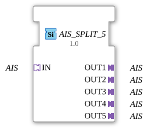

# AIS_SPLIT_5

* * * * * * * * * *
## Introduction

The function block **AIS_SPLIT_5** serves as a generic splitter for adapters of type `AIS` (unidirectional). It receives an incoming AIS signal via a socket and forwards it to five separate AIS plugs. This allows a single adapter signal to be distributed to multiple target blocks.
## Interface Structure

### **Event Inputs**

None.

### **Event Outputs**

None.

### **Data Inputs**

None.

### **Data Outputs**

None.

### **Adapter**

| Direction | Name | Type | Description |
|----------|-----|-----|--------------|
| Socket (Input) | IN | `adapter::types::unidirectional::AIS` | Incoming AIS adapter signal |
| Plug (Output 1) | OUT1 | `adapter::types::unidirectional::AIS` | First outgoing AIS adapter port |
| Plug (Output 2) | OUT2 | `adapter::types::unidirectional::AIS` | Second outgoing AIS adapter port |
| Plug (Output 3) | OUT3 | `adapter::types::unidirectional::AIS` | Third outgoing AIS adapter port |
| Plug (Output 4) | OUT4 | `adapter::types::unidirectional::AIS` | Fourth Outgoing AIS Adapter Port |
| Plug (Output 5) | OUT5 | `adapter::types::unidirectional::AIS` | Fifth Outgoing AIS Adapter Port |

## Functionality

This function block operates as a pure broadcast without its own logic or states. As soon as an event or data change arrives via socket `IN`, this signal is passed unchanged to all five plugs (`OUT1`–`OUT5`). Each plug can be connected to a different receiver function block, allowing the original signal to be processed simultaneously by multiple components.

## Technical Features

- **Generic Function Block**: The function block is marked as a generic function block (`eclipse4diac::core::GenericClassName = 'GEN_AIS_SPLIT'`). This allows it to be instantiated in various contexts with appropriate AIS adapter types.
- **No Event or Data Inputs/Outputs**: All communication takes place exclusively via the adapter interfaces. This makes it particularly simple and efficient.
- **Unidirectional**: The adapter type `AIS` is unidirectional, meaning the signal direction is fixed (from the socket to the plugs). Feedback is not provided.

## State Overview

The module has no internal state logic (no ECC). There is no internal state machine or delay. Its operation is based on a rigid, combinational routing.

## Application Scenarios

- **Signal Distribution in Control Systems**: An AIS signal supplied by a source (e.g., sensor or communication module) is to be passed on to several independent processing blocks.
- **Test and Simulation Environments**: A test signal can be sent simultaneously to various monitoring or analysis modules.
- **Redundant Processing**: The same signal is evaluated multiple times to detect errors or compare different algorithms.

## Comparison with Similar Components

Other splitter components, such as `AIS_SPLIT_2`, `AIS_SPLIT_3`, and `AIS_SPLIT_4`, offer fewer outputs. All of them distribute a single AIS input signal to multiple outputs. The `AIS_SPLIT_5` offers the maximum of five outputs in this family. The appropriate splitter can be selected based on requirements to avoid unnecessary cabling.

## Change Detection

Each output plug is updated independently: the incoming value is written to a given output, and its adapter event sent, only if it differs from that output's current value. Outputs that are already in sync stay quiet, while an output that was just connected (or has drifted out of sync) still receives the update it needs.

## Conclusion

The `AIS_SPLIT_5` is a simple yet effective generic function block for multiplying a unidirectional AIS adapter signal. It reduces cabling effort in the 4diac IDE and enables clean, modular structuring of control applications. It represents an optimal solution for applications requiring the distribution of a signal to up to five receivers.

---

### 🌐 Related topic subpages on ms-muc-docs.de

- [🌐 Eclipse 4diac IDE & Color Reference on ms-muc-docs.de](https://www.ms-muc-docs.de/iec-61499/eclipse-4diac/)

]
