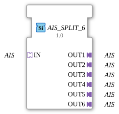

# AIS_SPLIT_6

* * * * * * * * * *

## Introduction

The function block **AIS_SPLIT_6** is used to distribute an incoming AIS (Automation Interface Signal) signal to six separate AIS outputs. It acts as a generic splitter, forwarding the incoming signal to all connected outputs without delay or manipulation.

## Interface Structure

### **Event Inputs**

No event inputs available.

### **Event Outputs**

No event outputs available.

### **Data Inputs**

No data inputs available (data transmission occurs exclusively via the adapter).

### **Data Outputs**

No data outputs available (data transmission occurs exclusively via the adapter).

### **Adapter**

| Type | Direction | Name | Description |
| ----- | ---------- | ------ | -------------- |
| `adapter::types::unidirectional::AIS` | Input (Socket) | IN | Incoming AIS signal, which is distributed to all outputs. |
| `adapter::types::unidirectional::AIS` | Output (Plug) | OUT1 | First output with the split AIS signal. |
| `adapter::types::unidirectional::AIS` | Output (Plug) | OUT2 | Second output with the split AIS signal. |
| `adapter::types::unidirectional::AIS` | Output (Plug) | OUT3 | Third output with the split AIS signal. |
| `adapter::types::unidirectional::AIS` | Output (Plug) | OUT4 | Fourth output with the split AIS signal. |
| `adapter::types::unidirectional::AIS` | Output (Plug) | OUT5 | Fifth output with the split AIS signal. |
| `adapter::types::unidirectional::AIS` | Output (Plug) | OUT6 | Sixth output with the split AIS signal. |

## Functionality

The module receives an AIS signal via socket `IN` and forwards it simultaneously and identically to all six plugs `OUT1` to `OUT6`. No data processing, filtering, or intermediate storage takes place – the distribution is purely signal-based. The function block operates unidirectionally (only from the input to the outputs) and thus represents a simple 1:6 multiplication of the AIS signal.

## Technical Features

- **Generic Type**: The function block is implemented as a generic function block (`GEN_AIS_SPLIT`), meaning it can be used with various AIS types as long as the adapter definition (`adapter::types::unidirectional::AIS`) matches.
- **Unidirectional**: Data exchange occurs only in one direction – from the input to the outputs. Feedback from the outputs to the input is not supported.
- **No Internal Logic**: Since there are neither events nor data inputs/outputs, the function block operates purely passively and requires no state machine or algorithms.
- **Easy Scalability**: Due to the fixed number of six outputs, the function block is optimized for typical applications requiring exactly six parallel AIS connections.

## State Overview

This function block does not have its own state machine (ECC). Its behavior is deterministic and timeless: An incoming AIS signal is immediately passed on to all outputs. There are no internal states or steps.

## Application Scenarios

- **Distributing Control Signals**: An AIS signal from a central controller (e.g., a higher-level function block) must be forwarded to several subordinate components.
- **Monitoring and Parallel Operation**: A signal should be used simultaneously for control, monitoring, and logging.
- **Test Setups**: A uniform test signal is distributed to several simulated or real modules.
- **Redundant Wiring**: Signal distribution via multiple paths to increase fault tolerance.

## Comparison with Similar Function Blocks

Other split function blocks may exist in the 4diac framework that differ in the number of outputs or data type. `AIS_SPLIT_6` is specifically designed for the AIS adapter interface and six outputs. Other splitters might have additional events or configuration parameters (e.g., selective routing), while this module is intentionally simple and requires no configuration.

## Change Detection

Each output plug is updated independently: the incoming value is written to a given output, and its adapter event sent, only if it differs from that output's current value. Outputs that are already in sync stay quiet, while an output that was just connected (or has drifted out of sync) still receives the update it needs.

## Conclusion

The `AIS_SPLIT_6` is a useful and minimalist module for signal splitters in AIS-based control systems. It reliably distributes an incoming signal to six outputs and is characterized by its simplicity, generic design, and clear interface separation. This makes it particularly suitable for modular, transparent control architectures.

--

### 🌐 Related topic subpages on ms-muc-docs.de

- [🌐 Eclipse 4diac IDE & color reference on ms-muc-docs.de ](https://www.ms-muc-docs.de/iec-61499/eclipse-4diac/)

]
