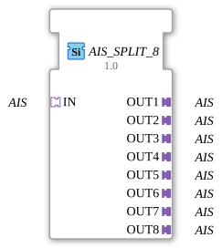

# AIS_SPLIT_8

* * * * * * * * * *
## Introduction
The function block **AIS_SPLIT_8** distributes an incoming AIS (Application Interface Socket) signal to eight identical output adapters. It is designed as a generic block and allows the simultaneous transmission of an AIS signal to multiple subsequent function blocks without data loss or delay.
## Interface Structure
### **Event Inputs**
None available.

### **Event Outputs**
None available.

### **Data Inputs**
None available.

### **Data Outputs**
None available.

### **Adapters**

| Direction | Name | Type | Description |
|----------|-------|----------------------------------|---------------------------------------------------|
| Input | IN | `adapter::types::unidirectional::AIS` | Incoming AIS signal to be distributed. |
Output | OUT1 | `adapter::types::unidirectional::AIS` | First output channel (identical to IN). |
Output | OUT2 | `adapter::types::unidirectional::AIS` | Second output channel (identical to IN). |
Output | OUT3 | `adapter::types::unidirectional::AIS` | Third output channel (identical to IN). |
Output | OUT4 | `adapter::types::unidirectional::AIS` | Fourth output channel (identical to IN). |
Output | OUT5 | `adapter::types::unidirectional::AIS` | Fifth output channel (identical to IN). |
Output | OUT6 | `adapter::types::unidirectional::AIS` | Sixth output channel (identical to IN). |
| Output | OUT7 | `adapter::types::unidirectional::AIS` | Seventh output channel (identical to IN). |
| Output | OUT8 | `adapter::types::unidirectional::AIS` | Eighth output channel (identical to IN). |

## Functionality
The module forwards the AIS signal present at adapter input `IN` unchanged and without delay to all eight output adapters `OUT1` to `OUT8`. No transformation, filtering, or buffering takes place. This behavior corresponds to a passive distribution (broadcast) of an AIS interface.

## Technical Features
- **Generic Type** – The function block is declared as `GEN_AIS_SPLIT` and can be adapted to specific AIS implementations via type parameterization (e.g., for different data types or event structures).
- **No Runtime Logic** – All functionality is implemented solely through the interconnection of the adapters; there are no internal algorithms or state machines.
- **Minimal Resource Requirements** – Since no active processing takes place, the function block incurs neither CPU load nor memory consumption during execution.

## State Overview

The function block has no internal states. The output signal is always a direct mapping of the input signal.

## Application Scenarios
- **Parallel Processing** – Splitting a sensor signal across multiple independent evaluation blocks.
- **Redundancy** – Distributing a control signal to multiple actuators in safety-critical systems.
- **Test and Simulation Environments** – Providing an identical signal for different observers or loggers.

## Comparison with Similar Modules
Unlike modules such as `AIS_MERGE_2` or `AIS_SELECT`, `AIS_SPLIT_8` does not have any selection or prioritization logic. Related variants differ only in the number of outputs (e.g., `AIS_SPLIT_2` or `AIS_SPLIT_4`). `AIS_SPLIT_8` is the maximum standard version for eight channels.

## Conclusion
AIS_SPLIT_8` is a simple and efficient module for replicating an AIS interface. Due to its generic nature and purely adapter-based implementation, it is ideally suited for building modular automation architectures that require distributed signal forwarding.
