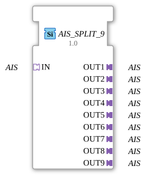

# AIS_SPLIT_9

* * * * * * * * * *
## Introduction

The **AIS_SPLIT_9** function block is used to distribute an incoming unidirectional **AIS** adapter (Application Interface Socket) to nine identical outgoing **AIS** adapters (plugs). It is designed as a generic building block and enables the simple duplication of an AIS signal for up to nine downstream function blocks.
## Interface Structure

### **Event Inputs**

No event inputs available.

### **Event Outputs**

No event outputs available.

### **Data Inputs**

No data inputs available.

### **Data Outputs**

No data outputs available.

### **Adapters**

| Name | Type | Direction | Description |
|-------------|----------------------|----------|-----------------------------------------------------|
| **IN** | AIS (unidirectional) | Socket | Input adapter – the AIS signal to be distributed. |
| **OUT1** | AIS (unidirectional) | Plug | First output – identical copy of the input signal. |
| **OUT2** | AIS (unidirectional) | Plug | Second output – identical copy of the input signal. |
| **OUT3** | AIS (unidirectional) | Plug | Third output – identical copy of the input signal. |
| **OUT4** | AIS (unidirectional) | Plug | Fourth output – identical copy of the input signal. |
| **OUT5** | AIS (unidirectional) | Plug | Fifth output – identical copy of the input signal. |
| **OUT6** | AIS (unidirectional) | Plug | Sixth output – identical copy of the input signal. |
| **OUT7** | AIS (unidirectional) | Plug | Seventh output – identical copy of the input signal. |
| **OUT8** | AIS (unidirectional) | Plug | Eighth output – identical copy of the input signal. |
| **OUT9** | AIS (unidirectional) | Plug | Ninth output – identical copy of the input signal. |

## Functionality

The **AIS_SPLIT_9** is a purely combinational function block without its own state logic or event control. It receives an AIS signal at the **Socket IN** and forwards it unchanged to all nine **Plugs OUT1** to **OUT9**. Any change at the input is immediately transmitted to all outputs. The function block thus acts as a passive signal distributor ("broadcast") on the AIS interface.

## Technical Features

- **Generic Function Block**: The function block is defined as a generic type (`GenericClassName = GEN_AIS_SPLIT`). This allows for flexible reuse in different AIS contexts without having to recreate the function block for each application.
- **Unidirectional Transmission**: Both inputs and outputs use the unidirectional **AIS** adapter type, meaning data flows in only one direction (from the input to the outputs).
- **No Data Buffering or Delay**: Due to the lack of event and data handling, the function block operates without buffering or clocking – it is strictly signal-passing.
- **Simple Interface**: The function block has neither events nor data inputs/outputs, but only adapters. This makes it particularly lightweight and suitable for pure signal coupling.

## State Overview

The **AIS_SPLIT_9** has no internal states or sequence controls. Its behavior is deterministic and always determined by the input signal. There are no initializing or fault states.

## Application Scenarios

- **Signal Multiplication**: An AIS-based control signal is to be passed on in parallel to several independent actuators, controllers, or displays.
- **Broadcast in Modular Systems**: In a distributed automation environment, a central measured value (e.g., temperature, pressure) is provided via AIS and must be consumed simultaneously by several function blocks.
- **Prototyping and Testing**: A test signal is to be distributed to multiple instances of the same function block type without requiring the source function block to be instantiated multiple times.

## Comparison with Similar Components

- **AIS_SPLIT_2 / AIS_SPLIT_4 / AIS_SPLIT_8** etc.: These components distribute the input signal to 2, 4, or 8 outputs. The **AIS_SPLIT_9** is specifically designed for applications requiring exactly nine parallel connections. The functionality is identical – the only difference lies in the number of outputs.
- **AIS_MERGE**: Unlike the Split component, a Merge component combines multiple inputs into a single output. **AIS_SPLIT_9** implements the reverse data flow.
- **Direct Coupling**: Instead of a Split component, manual wiring (multiple OUT adapters) could also be performed in the 4diac IDE. However, the **AIS_SPLIT_9** simplifies the graphical representation and reduces the complexity of the network.

**AIS_MERGE**
## Change Detection

Each output plug is updated independently: the incoming value is written to a given output, and its adapter event sent, only if it differs from that output's current value. Outputs that are already in sync stay quiet, while an output that was just connected (or has drifted out of sync) still receives the update it needs.

## Conclusion

The **AIS_SPLIT_9** is a simple yet extremely useful function block for duplicating a unidirectional AIS signal to nine outputs. Its generic design, the absence of event or data logic, and its clear interface make it a reliable tool for modular automation solutions. It is particularly suitable for applications where a signal needs to be distributed to multiple receivers without delay or modification.

---

### 🌐 Related topic subpages on ms-muc-docs.de

* [🌐 Eclipse 4diac IDE & color reference on ms-muc-docs.de](https://www.ms-muc-docs.de/iec-61499/eclipse-4diac/)

]
