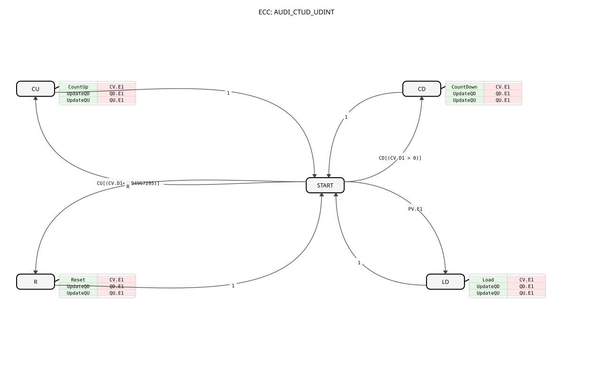

# AUDI_CTUD_UDINT (Adapter-Based Up/Down Counter)

## Introduction
The `AUDI_CTUD_UDINT` is an event-driven up/down counter for unsigned 32-bit integers (UDINT), specifically designed for integration into adapter-based systems. It utilizes the `AUDI` adapter for passing the counter value and the default value, enabling a clean separation of event and data flow.

## Interface Structure

### **Event Inputs**

- **CU**: `Event` - Increments the value by one (`Count Up`).

- **CD**: `Event` - Decrements the value by one (`Count Down`).

- **R**: `Event` - Resets the counter to zero (`Reset`).

### **Event Outputs**

- **CO**: `Event` - Triggered when the counter reaches the default value `PV` (`Count Output`).

- Linked to variables `QU` and `QD`.

- **RO**: `Event` - Triggered when the counter is reset to zero (`Reset Output`).

- Linked to variables `QU` and `QD`.

### **Output Variables**

- **QU**: `BOOL` - `TRUE` when the counter value (`CV.D1`) is greater than or equal to the default value (`PV.D1`).

- **QD**: `BOOL` - `TRUE`, if the counter value (`CV.D1`) is less than or equal to zero.

### **Adapter**

- **CV** (Plug): `AUDI` - The current counter value (`Counter Value`).

- **PV** (Socket): `AUDI` - The default value (`Preset Value`) against which the counter is checked (for `QU`).

## Functionality
The counter reacts to the event inputs `CU`, `CD` and `R`. A `CU` event increments `CV.D1` by 1, a `CD` event decrements `CV.D1` by 1. A `R` event resets `CV.D1` to 0.

Loading a default value (`PV.D1`) into the counter (`CV.D1`) occurs automatically when an event (`PV.E1`) arrives at the `PV` adapter. This replaces the explicit `LD` input of the original `E_CTUD_UDINT`.

The counter value is output via the `CV` adapter as the `AUDI` signal. The outputs `CO` and `RO` signal state changes and provide `QU`/`QD`.

## Technical Features
✔ **Adapter-based**: Seamless integration into AX systems.

✔ **Event-driven**: No cyclic calls required.

✔ **UDINT-based**: Supports the full range of unsigned 32-bit integers.

✔ **Simplified Loading Logic**: The explicit `LD` input has been removed and replaced by event detection on the `PV` adapter (`PV.E1`). The `LDO` output has been eliminated. Instead, `CV.E1` signals the value change.

## Application Scenarios

- **Piece Counting**: Counting objects in production lines.

- **Operating Hour Counter**: Recording operating times (in combination with timers).

- **Position Monitoring**: Simple position counters in handling systems.

## 🛠️ Related exercises

* [Uebung_009_AX](../../../../../../Uebungen/test_AX/Uebungen_doc/Uebung_009_AX.md)
* [Uebung_083_AX](../../../../../../Uebungen/test_AX/Uebungen_doc/Uebung_083_AX.md)

---

### 🌐 Matching topic subpages on ms-muc-docs.de
* [🌐 E_CTU Event Counter block on ms-muc-docs.de](https://www.ms-muc-docs.de/iec-61499/event-function-blocks/e_ctu/)
