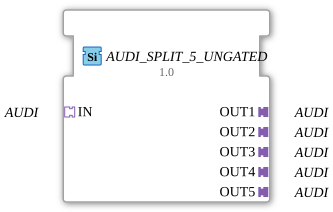

# AUDI_SPLIT_5_UNGATED

> ℹ️ **UNGATED variant:** This block is the ungated version of [`AUDI_SPLIT_5`](AUDI_SPLIT_5.md). It suppresses **no** unchanged repeats – every newly computed result is forwarded unconditionally, even without a value change. This matters for consumers that need a periodic cadence regardless of value change (e.g. derivative/frequency calculations that would otherwise fail to decay toward zero). Any change-detection/gating statements further down this page do **not** apply to this block.

* * * * * * * * * *

## Introduction

The function block **AUDI_SPLIT_5_UNGATED** is used to distribute a single incoming AUDI signal to five identical AUDI outputs. It is designed as a generic adapter module and allows for flexible further processing of the signal along multiple paths.

## Interface Structure

### **Event Inputs**

None available.

### **Event Outputs**

None available.

### **Data Inputs**

None available.

### **Data Outputs**

None available.

### **Adapter**

| Direction | Name | Type | Description |
| ---------- | ------ | ----- | -------------- |
| **Socket** | `IN` | `adapter::types::unidirectional::AUDI` | Incoming AUDIO Signal |
| **Plug** | `OUT1` | `adapter::types::unidirectional::AUDI` | First Output |
| **Plug** | `OUT2` | `adapter::types::unidirectional::AUDI` | Second Output |
| **Plug** | `OUT3` | `adapter::types::unidirectional::AUDI` | Third Output |
| **Plug** | `OUT4` | `adapter::types::unidirectional::AUDI` | Fourth Output |
| **Plug** | `OUT5` | `adapter::types::unidirectional::AUDI` | Fifth Output |

## Functionality

This function block forwards the AUDI signal present at socket `IN` unchanged and simultaneously to all five plugs `OUT1` to `OUT5`. No signal processing, conversion, or buffering takes place – distribution occurs purely at the adapter level as soon as a connection to the outputs is established.

## Technical Features

- **Generic Function Block**: The function block is implemented as a generic type (`GEN_AUDI_SPLIT`). It can be instantiated for various data types via appropriate runtime environment mechanisms, as long as these data types conform to the unidirectional AUDI adapter protocol.
- **No State Logic**: The function block contains no event or data processing and no internal state machine.
- **Simple and High-Performance Signal Distribution**: Due to its pure adapter structure, it is particularly suitable for scenarios where a signal needs to be duplicated without latency.

## State Overview

The function block does not have an explicit state machine. Its behavior is deterministic: As long as the function block is in operation, every signal arriving at `IN` is immediately passed on to all outputs.

## Application Scenarios

- **Distributing control signals** in industrial automation, e.g., a start/stop command that is intended to reach several identical modules.
- **Duplicating a measured value** for parallel evaluations or visualizations.
- **Establishing redundancy paths** by using the same signal multiple times.

## Comparison with Similar Function Blocks

Unlike function blocks such as `AUDI_MERGE_5` (combining multiple signals) or `AUDI_SPLIT_2` (only two outputs), `AUDI_SPLIT_5_UNGATED` offers a specific distribution across exactly five outputs. Generic split function blocks for other numbers (e.g., `AUDI_SPLIT_N`) often exist as templates, while this function block covers a fixed, but frequently required, configuration.

## Change Detection

This block performs **no** change detection. Every newly computed result is written to the output and its adapter event fired unconditionally, regardless of whether the value differs from the previous run.

## Conclusion

AUDI_SPLIT_5_UNGATED` is a simple and efficient adapter function block for signal distribution. Its generic design and the absence of event/data logic make it lightweight and versatile. It is ideally suited for all applications where an audio signal needs to be split across five parallel paths.
