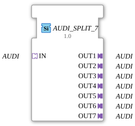

# AUDI_SPLIT_7

* * * * * * * * * *
## Introduction
The function block `AUDI_SPLIT_7` is used to distribute a single AUDI input signal to seven identical AUDI output signals. It is designed as a generic building block and is suitable for all unidirectional AUDI adapter types.
## Interface Structure

### **Event Inputs**
None

### **Event Outputs**
None

### **Data Inputs**
None

### **Data Outputs**
None

### **Adapter**

| Name | Type | Direction |
|--------|--------------------------------|----------|
| `IN` | `adapter::types::unidirectional::AUDI` | Socket (Input) |
OUT1` | `adapter::types::unidirectional::AUDI` | Plug (Output) |
OUT2` | `adapter::types::unidirectional::AUDI` | Plug (Output) |
OUT3` | `adapter::types::unidirectional::AUDI` | Plug (Output) |
OUT4` | `adapter::types::unidirectional::AUDI` | Plug (Output) |
OUT5` | `adapter::types::unidirectional::AUDI` | Plug (Output) |
OUT6` | `adapter::types::unidirectional::AUDI` | Plug (Output) |
| `OUT7` | `adapter::types::unidirectional::AUDI` | Plug (Output) |

All adapters are of the unidirectional type `AUDI` and transmit data exclusively from the socket to the plugs.

## Functionality

The module copies the AUDIO data received via socket `IN` unchanged to all seven plug outputs `OUT1` to `OUT7`. No processing or conversion of the data takes place – the function is limited to a simple 1-to-7 distribution (fan-out). Since there are no events or explicit data ports, the signal behavior is entirely defined by the connected adapters.

#
# Functionality #
- **Generic Type**: The component is marked as generic via the attribute `eclipse4diac::core::GenericClassName` (`'GEN_AUDI_SPLIT'`). This allows it to be used for various specific implementations of the AUDI adapter without requiring a separate implementation.
- **No Runtime Dependency**: The component has no algorithm and no state diagram; signal transmission occurs purely structurally through the adapter wiring.
- **Type Hash**: The attribute `eclipse4diac::core::TypeHash` is empty, meaning that the type identity is not additionally secured at runtime.

## State Overview

The component does not contain a state machine (ECC). Its behavior is completely deterministic and eventless – a state representation is therefore not required.

## Application Scenarios
- **Signal Distribution**: An AUDI signal from a sensor or control unit must be forwarded in parallel to multiple consumers (actuators, displays, monitoring systems).
- **System Expansion**: Existing systems that provide a single AUDI signal are to be expanded with additional components without changing the source logic.
- **Test Setups**: A generated test signal is to be sent to multiple devices under test simultaneously.

## Comparison with Similar Components

| Component | Distribution | Adapter Type |
------------------|--------------------------|------------------------|
| `AUDI_SPLIT_7` | 1 input → 7 outputs | Unidirectional `AUDI` |
| `SPLIT_1_TO_2` (analog) | 1 → 2 | Any (generic) |
| `AUDI_MERGE` | Multiple Inputs → 1 | Unidirectional `AUDI` |

While `AUDI_SPLIT_7` is designed for the specific AUDI adapter type, generic split modules exist for other data formats. Its limitation to a fixed number of seven outputs distinguishes it from flexible splitters with a configurable number of outputs.

## Conclusion

AUDI_SPLIT_7` is a simple yet effective module for distributing an AUDI signal to seven identical paths. Its generic design allows it to be reused in various contexts. The absence of events and internal logic makes it lightweight and reliable for pure signal distribution tasks.

### 🌐 Related topic subpages on ms-muc-docs.de
* [🌐 Eclipse 4diac IDE & Color Reference on ms-muc-docs.de](https://www.ms-muc-docs.de/iec-61499/eclipse-4diac/)
