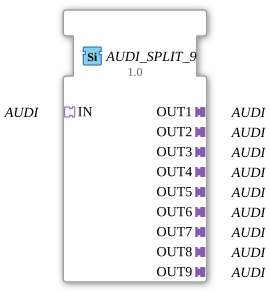

# AUDI_SPLIT_9

* * * * * * * * * *
## Introduction

The function block `AUDI_SPLIT_9` is used to distribute an incoming AUDI signal via a socket to nine identical AUDI plugs. It implements a 1-to-9 split functionality, where all outputs always carry the same value as the input. The block is defined as a generic FB (GenericClassName `GEN_AUDI_SPLIT`) and enables the easy duplication of AUDI data streams within a 4diac IDE application.
## Interface Structure

### **Event Inputs**

No event inputs are available. Data transmission occurs exclusively via the adapter interfaces.

### **Event Outputs**

No event outputs are available. The output signals are provided directly via the adapter plugs.

### **Data Inputs**

No direct data inputs are available. Input data is read via the socket adapter `IN`.

### **Data Outputs**

No direct data outputs are available. Output data is provided via the nine plug adapters `OUT1` to `OUT9`.

### **Adapters**

| Adapter | Type | Direction | Description |
|---------|-----|-----------|--------------|
| `IN` | `adapter::types::unidirectional::AUDI` | Socket (Input) | Receives the AUDI signal to be distributed. |
| `OUT1` ... `OUT9` | `adapter::types::unidirectional::AUDI` | Plug (Output) | Nine outputs that replicate the value of `IN`. Each output is identical and independent. |

## Functionality

This component establishes a passive coupling between the socket `IN` and the nine plugs `OUT1` to `OUT9`. Whenever the socket receives a valid AUDI data packet, it is forwarded unchanged to all nine plugs. No data modification, buffering, or time delay occurs. The component has no inherent behavior – it functions purely as a wiring aid for signal distribution.

## Technical Features

- **Generic Implementation:** The function block (FB) carries the attribute `eclipse4diac::core::GenericClassName = 'GEN_AUDI_SPLIT'`, which allows it to be recognized as an instance of a generic split block and displayed correctly in tools with generic type support.
- **No Event Control:** Since no events are present, data transmission occurs purely via the adapter mechanisms of the target system (e.g., continuously or cyclically, depending on the runtime environment).
- **Scalability:** The number of outputs is fixed at nine. For other numbers, separate FB types (e.g., `AUDI_SPLIT_2`, `AUDI_SPLIT_4`, etc.) must be defined, or a parameterizable function block must be used.

## State Overview

The function block has no internal state. Its behavior is completely static and defined solely by the forwarding of the signal. A state machine does not exist.

## Application Scenarios

- **Distributing a measurement signal** to multiple parallel evaluation or control units.
- **Splitting a control command** to multiple actuators, provided they use the same AUDI protocol.
- **Test and simulation environments** where a generated signal needs to be sent to multiple observers (e.g., logging, visualization, control) simultaneously.
- **Replacing multiple copies** of a source function block when the source exists only once.

## Comparison with Similar Function Blocks

Compared to a general-purpose `AUDI_MERGE` (which combines multiple inputs into one output) or a `AUDI_SELECT` (which switches between multiple inputs), the Split function block offers the exact opposite function: duplication instead of merging or selection. Compared to a custom, software-implemented split (e.g., by connecting an output multiple times in the application), the function block (FB) ensures a clean, typed, and reusable interface and avoids potential multiple connection errors in the editor.

## Change Detection

Each output plug is updated independently: the incoming value is written to a given output, and its adapter event sent, only if it differs from that output's current value. Outputs that are already in sync stay quiet, while an output that was just connected (or has drifted out of sync) still receives the update it needs.

## Conclusion

The `AUDI_SPLIT_9` is a simple yet useful function block for duplicating audio signals. Its implementation as a generic type and the clear separation of input and nine outputs facilitate the development of modular automation solutions. Due to its static nature, it is particularly suitable for data flow-oriented applications where event control is not required.

---

### 🌐 Related topic subpages on ms-muc-docs.de

- [🌐 Eclipse 4diac IDE & color reference on ms-muc-docs.de ](https://www.ms-muc-docs.de/iec-61499/eclipse-4diac/)

]
