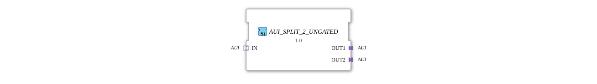

# AUI_SPLIT_2_UNGATED

> ℹ️ **UNGATED variant:** This block is the ungated version of [`AUI_SPLIT_2`](AUI_SPLIT_2.md). It suppresses **no** unchanged repeats – every newly computed result is forwarded unconditionally, even without a value change. This matters for consumers that need a periodic cadence regardless of value change (e.g. derivative/frequency calculations that would otherwise fail to decay toward zero). Any change-detection/gating statements further down this page do **not** apply to this block.

* * * * * * * * * *

## Introduction

The function block **AUI_SPLIT_2_UNGATED** distributes a signal received from one AUI adapter (socket) unchanged to two identical AUI adapters (plugs). It is delivered as a generic function block (GenericClassName = `'GEN_AUI_SPLIT'`) and enables the simple splitting of a unidirectional AUI data stream to two independent sinks.

## Interface Structure

### **Event Inputs**

No event inputs available.

#### **Event Outputs**

No event outputs available.

#### **Data Inputs**

No direct data inputs available. Data is transported exclusively via the adapters.

#### **Data Outputs**

No direct data outputs available. Data is transmitted exclusively via the adapters.

### **Adapters**

| Name | Type | Direction / Role |
| ------ | ----- | ------------------ |
| `IN` | `adapter::types::unidirectional::AUI` | Socket (Input) |
| `OUT1` | `adapter::types::unidirectional::AUI` | Plug (Output 1) |
| `OUT2` | `adapter::types::unidirectional::AUI` | Plug (Output 2) |

All three adapters are of type **AUI** and operate unidirectionally. Socket `IN` receives data, and plugs `OUT1` and `OUT2` forward the same data.

## Functionality

This component forwards every incoming AUI signal at socket `IN` simultaneously to both plugs `OUT1` and `OUT2`. No processing, filtering, or buffering of the data takes place—the data is copied and sent **1:1**. The distribution is strictly deterministic and without any additional delay (apart from the propagation time of the internal connection).

## Technical Features

- **Generic Type**: The function block is identified by the attribute `GenericClassName` as `'GEN_AUI_SPLIT'` and can be instantiated at runtime using type-hash mechanisms (`TypeHash` is currently empty).
- **No ECC (Execution Control Chart)**: Since there is no event-driven logic, the function block does not have a state machine. The routing is purely data-driven.
- **EPL 2.0 Licensed**: The function block is provided under the Eclipse Public License 2.0.

## State Overview

The AUI_SPLIT_2_UNGATED function block has **no state machine**. There are no internal states or transitions – the signal is continuously routed without clocking.

## Application Scenarios

- **Signal Distribution**: An AUI data stream needs to be transmitted in parallel to two independent receivers or subsystems (e.g., two controllers, displays, or actuators).
- **Redundancy**: Identical data should be provided on two paths to support failover mechanisms.
- **Protocol Multicasting**: A unidirectional AUI stream is distributed to multiple consumers without requiring the sender to be addressed multiple times.

## Comparison with Similar Components

- **AUI_SPLIT_N**: An extended variant that splits one input into N outputs (e.g., 1:3, 1:4). The AUI_SPLIT_2_UNGATED is the simplest member of this family.
- **AUI_MERGE_2**: Combines two AUI inputs into one output (optionally with arbitration). The splitter operates in the opposite direction.
- **AUI_PASS**: A pure 1:1 pass-through adapter without branching.

## Change Detection

This block performs **no** change detection. Every newly computed result is written to the output and its adapter event fired unconditionally, regardless of whether the value differs from the previous run.

## Conclusion

The **AUI_SPLIT_2_UNGATED** is a minimalist yet useful function block for splitting a unidirectional AUI signal into two outputs. Thanks to its generic implementation and the absence of complex logic, it is ideally suited for scenarios requiring clean, lossless duplication of data streams.
