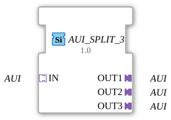

# AUI_SPLIT_3

* * * * * * * * * *
## Introduction
The function block **AUI_SPLIT_3** serves as a generic splitter that distributes a single incoming AUI interface to three identical outgoing AUI interfaces. It allows for the simple duplication of a unidirectional adapter (of type `adapter::types::unidirectional::AUI`) without altering the events or data it carries.
## Interface Structure

### **Event Inputs**

None – the function block has no independent event inputs. Event forwarding occurs exclusively via the AUI adapters.

### **Event Outputs**

None – the function block has no independent event outputs. Event forwarding occurs exclusively via the AUI adapters.

### **Data Inputs**

None – the FB has no independent data inputs. Data is transmitted via the AUI adapters.

### **Data Outputs**

None – the FB has no independent data outputs. Data is transmitted via the AUI adapters.

### **Adapters**

| Direction | Name | Type | Description |

|----------|------|-----|--------------|

| Socket (Input) | `IN` | `adapter::types::unidirectional::AUI` | Incoming AUI interface distributed across three outputs. |

| Plug (Output) | `OUT1` | `adapter::types::unidirectional::AUI` | First outgoing AUI output (identical to the input signal). |

| Plug (Output) | `OUT2` | `adapter::types::unidirectional::AUI` | Second outgoing AUI output (identical to the input signal). |

| Plug (Output) | `OUT3` | `adapter::types::unidirectional::AUI` | Third outgoing AUI output (identical to the input signal). |

## Functionality

The module functions purely as a signal distributor. It receives an AUI interface via socket `IN` and forwards all incoming events and data unchanged to the three plugs `OUT1`, `OUT2`, and `OUT3`. No processing, delay, or state change takes place. The function block (FB) is therefore **stateless** and behaves like a simple replication of wiring.

## Technical Features
- **Generic Structure**: The function block is labeled as a generic FB (`GEN_AUI_SPLIT`), allowing it to be used with various AUI adapter variants (with different event/data signatures).
- **Unidirectional**: The adapter type `unidirectional` means that data and event flows are only in one direction (from the socket to the plugs). Backward communication is not supported.
- **No Latency**: Due to the absence of internal logic, no measurable delay occurs.
- **No Configuration**: The FB requires no parameters – the number of outputs is fixed at three.

## State Overview

The function block does not have an internal state machine. There is only one continuous operating state in which the input interface is permanently mirrored to the three output interfaces.

## Application Scenarios
- **Signal Multiplication**: An AUI signal from a sensor or controller is to be forwarded to multiple independent receivers (e.g., actuators, displays, other controllers).
- **Monitoring**: An existing AUI data stream is copied to a monitoring unit without affecting the original signal paths.
- **Test and Simulation Environments**: A test stimulus is to be distributed in parallel to multiple components under test.

## Comparison with Similar Components

| Component | Outputs | Properties |

|----------|----------|---------------|

| `AUI_SPLIT_2` | 2 | Same functionality, but only two outputs. |

| `AUI_SPLIT_4` | 4 | Extended version with four outputs. |

| `AUI_MERGE` | – | Combines multiple AUI inputs into one output (opposite function). |

The `AUI_SPLIT_3` represents a specific configuration that provides exactly three identical outputs. It can be replaced by other splitter variants if needed.

## Conclusion

The `AUI_SPLIT_3` is a simple yet useful generic function block for multiplying a unidirectional AUI interface. Thanks to its pure pass-through function and lack of state logic, it is reliable, performant, and easily integrated into existing automation solutions. It is particularly suitable for applications where a signal needs to be split across multiple paths.
