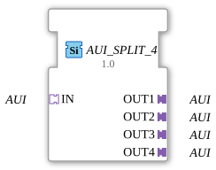

# AUI_SPLIT_4

* * * * * * * * * *
## Introduction
The function block **AUI_SPLIT_4** serves as a generic distributor for AUI signals. It accepts a single AUI input (socket) and routes it to four separate AUI outputs (plugs). This block is typically used in automation technology when a unidirectional signal is required multiple times in parallel.
## Interface Structure

### **Event Inputs**

None available.

### **Event Outputs**

None available.

### **Data Inputs**

None available.

### **Data Outputs**

None available.

### **Adapters**

| Direction | Name | Type | Description |

|----------|--------|----------------------------|--------------------------------------------|

Socket | `IN` | `adapter::types::unidirectional::AUI` | Input signal (AUI) |

Plug | `OUT1` | `adapter::types::unidirectional::AUI` | First output (identical to IN) |

Plug | `OUT2` | `adapter::types::unidirectional::AUI` | Second output (identical to IN) |

Plug | `OUT3` | `adapter::types::unidirectional::AUI` | Third output (identical to IN) |

Plug | `OUT4` | `adapter::types::unidirectional::AUI` | Fourth output (identical to IN) |

## Functionality

This function block does not perform any data manipulation. It acts as a passive distribution unit: As soon as a signal is present via adapter `IN`, it is passed on to all four output adapters `OUT1`–`OUT4` without delay or modification. The signal direction is unidirectional, from the socket to the plugs.

## Technical Features
- **Generic Type:** The function block is declared as a generic function block (`GenericClassName = 'GEN_AUI_SPLIT'`). It can therefore be used with various implementations of the AUI adapter type.
- **No States:** Since there are no events or algorithms, the function block does not have an internal state machine.
- **License:** The source code is available under the **Eclipse Public License 2.0**.

## State Overview

This function block has no event inputs or outputs and does not execute any algorithm. There is no explicit state machine. The function block behaves like a simple signal distributor (wire connection).

## Application Scenarios
- **Signal Cascading:** A sensor signal (e.g., an AUI-based clock signal) needs to be distributed to multiple actuators.
- **Test Environments:** A test signal is to be routed in parallel to multiple devices under test.
- **Redundancy:** A signal is split across multiple parallel paths to ensure fault tolerance.
- **Bus Extension:** As a passive splitter in an AUI communication system.

## Comparison with Similar Function Blocks
- **AUI_SPLIT_2** – Splits one input into two outputs (analog principle, fewer outputs).
- **AUI_MERGE** – Combines multiple AUI inputs into a single output (counterpart).
- **AUI_SELECT** – Selects one of several inputs using a control signal (with selection function).
- Unlike these function blocks, `AUI_SPLIT_4` offers a pure 1:4 distribution without selection logic or merging.

## Conclusion

The **AUI_SPLIT_4** function block is a simple yet useful component for passively multiplying AUI signals. Its generic nature and clear interface make it a flexible tool in automation development, especially when multiple identical receivers need to be supplied with the same signal.