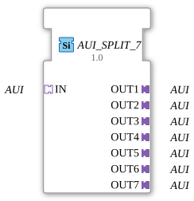

# AUI_SPLIT_7

* * * * * * * * * *
## Introduction
The function block `AUI_SPLIT_7` is used to distribute an incoming AUI (Application User Interface) signal to up to seven identical outputs. It is designed as a generic block and operates exclusively via adapter interfaces – without event or data inputs/outputs in the traditional sense. This makes it particularly suitable for pure signal distribution in adapter-based architectures.

## Interface Structure
### **Event Inputs**
None available.

### **Event Outputs**
None available.

### **Data Inputs**
None available.

### **Data Outputs**
None available.

### **Adapter**

| Type | Direction | Name |

| --- | -------- | ---- |

Socket (adapter::types::unidirectional::AUI) | Input | IN |

Plug (adapter::types::unidirectional::AUI) | Output | OUT1 |

Plug (adapter::types::unidirectional::AUI) | Output | OUT2 |

Plug (adapter::types::unidirectional::AUI) | Output | OUT3 |

Plug (adapter::types::unidirectional::AUI) | Output | OUT4 |

Plug (adapter::types::unidirectional::AUI) | Output | OUT5 |

Plug (adapter::types::unidirectional::AUI) | Output | OUT6 |

Plug (adapter::types::unidirectional::AUI) | Output | OUT7 |

## Functionality

This module represents a 1-to-7 distribution logic for AUI adapters. The signal received via socket `IN` is replicated to all seven plugs (`OUT1` … `OUT7`) without further processing or logical conditions. The forwarding is purely passive: each received signal is simultaneously made available at every output.

## Technical Features

- **Pure Adapter Module**: The module contains neither event nor data inputs/outputs – all communication takes place via the AUI adapters.

- **Unidirectional**: The adapters are of type `unidirectional`, meaning that data flows only from the input (socket) to the outputs (plugs).

- **Generic Type**: The function block (FB) is implemented as a generic block (`GenericClassName = 'GEN_AUI_SPLIT'`) and can be reused for various AUI subtypes.

- **No State Logic**: Due to its pure distribution function, the block has no internal state machine – it operates continuously and without delay.

## State Overview
There is no state machine. The block is purely data flow controlled and has only one static operating state.

## Application Scenarios

- **Signal Distribution in Field Automation**: An AUI signal (e.g., sensor data or control commands) coming from a central controller is forwarded to several parallel actuators or display units.

- **Test and Simulation Environments**: Used as a splitter to simultaneously output an input signal to multiple simulation or diagnostic units.

- **Modular Systems**: In adapter-based architectures (e.g., according to IEC 61499), this function block is used to distribute a single interface across multiple downstream function blocks.

## Comparison with Similar Function Blocks

- **AUI_SPLIT_2, AUI_SPLIT_4** – Function blocks with the same functionality, but reduced to 2 or 4 outputs, respectively. The `AUI_SPLIT_7` offers the largest number of outputs and thus covers more extensive distribution requirements.

- **AUI_MERGE** – the counterpart that combines multiple AUI inputs into a single output. In contrast, the `SPLIT` is purely passive and does not aggregate any data.

## Conclusion
The `AUI_SPLIT_7` is a simple yet essential function block for unidirectional signal distribution in adapter-based control systems. Thanks to its generic design and clear 1-to-N structure, it can be flexibly integrated into any AUI-based architecture. For applications requiring broad parallel distribution without side effects, it represents a robust and maintainable solution.