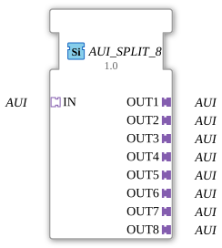

# AUI_SPLIT_8

* * * * * * * * * *
## Introduction

The function block `AUI_SPLIT_8` is used to distribute an incoming AUI adapter signal (unidirectional) to eight identical output adapters. It functions as a passive splitter and enables the simple distribution of a signal path to multiple downstream components. The function block is generic and uses the adapter pattern of IEC 61499.
## Interface Structure

### **Event Inputs**

None.

### **Event Outputs**

None.

### **Data Inputs**

None.

### **Data Outputs**

None.

### **Adapters**

| Adapter | Type | Direction |
|---------|-----|----------|
| **IN** | `adapter::types::unidirectional::AUI` | Socket (Input) |
| **OUT1** | `adapter::types::unidirectional::AUI` | Plug (Output) |
| **OUT2** | `adapter::types::unidirectional::AUI` | Plug (Output) |
| **OUT3** | `adapter::types::unidirectional::AUI` | Plug (Output) |
| **OUT4** | `adapter::types::unidirectional::AUI` | Plug (Output) |
| **OUT5** | `adapter::types::unidirectional::AUI` | Plug (Output) |
| **OUT6** | `adapter::types::unidirectional::AUI` | Plug (Output) |
| **OUT7** | `adapter::types::unidirectional::AUI` | Plug (Output) |
| **OUT8** | `adapter::types::unidirectional::AUI` | Plug (Output) |

## Functionality

This module forwards all data and events received via the `IN` socket of the unidirectional AUI adapter to all eight `OUT` adapters. No logical or temporal processing takes place; the forwarding is one-to-one and without latency. The adapters are of the same type (`AUI`), so the complete signature (data, events, and included interfaces) is passed through unchanged.

## Technical Features

- **Generic Type**: The component is declared as generic using `GenericClassName` (`GEN_AUI_SPLIT`). It can therefore be used for various AUI adapter variants (e.g., different data widths), provided the underlying type is `adapter::types::unidirectional::AUI`.
- **Unidirectional**: The adapters are unidirectional – data transmission is only possible in one direction (from IN to OUT). Return channels are not included.
- **No State Logic**: The component has no internal states, algorithms, or event processing. It is purely structural (passive wiring).

## State Overview

The component has no states. It behaves statically and always passes through all incoming signals.

## Application Scenarios

- **Signal Distribution in Automation Networks**: A sensor or controller provides an AUI-compliant signal that needs to be distributed to multiple actuators or subsystems.
- **Test and Simulation Environments**: Distributing a test signal across multiple parallel test paths.
- **Redundant Signal Paths**: Simultaneously supplying multiple independent controllers with the same information.

## Comparison with Similar Components

- **`AUI_MERGE_8`** (counterpart): Combines eight AUI inputs into one output (inverse operator).
- **`AUI_SPLIT_2`, `AUI_SPLIT_4`**: Same functionality with fewer outputs.
- **Event Splitters (e.g., `E_SPLIT`)**: Distribute only events without the accompanying data from an adapter. `AUI_SPLIT_8`, on the other hand, replicates the entire adapter content.

## Conclusion

The `AUI_SPLIT_8` is a simple yet essential component for replicating a unidirectional AUI signal path. Due to its generic design and purely passive structure, it is suitable for any AUI-based application where a signal needs to be distributed to up to eight receivers. The implementation is lean, error-free, and requires no configuration.
