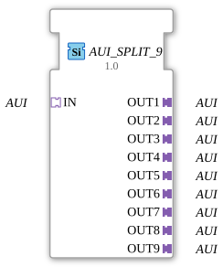

# AUI_SPLIT_9
[Image of the function block not available]

* * * * * * * * * *
## Introduction
The function block **AUI_SPLIT_9** serves as a generic splitter for unidirectional AUI adapter connections. It receives an incoming AUI signal via socket `IN` and distributes it identically to nine separate output plugs (`OUT1` to `OUT9`). The block is typed as a generic function block (`GEN_AUI_SPLIT`) and can be used in various automation environments where an AUI signal needs to be passed on to multiple downstream components.

## Interface Structure

### **Event Inputs**

Not present. The function block operates purely on an adapter basis without event control.

### **Event Outputs**

Not available.

### **Data Inputs**

Not available.

### **Data Outputs**

Not available.

### **Adapters**

**Socket (Input):**

- `IN` – Type: `adapter::types::unidirectional::AUI`
Receives the AUI signal to be distributed.

**Plugs (Outputs):**

- `OUT1` to `OUT9` – each Type: `adapter::types::unidirectional::AUI`
Nine identical outputs that forward the incoming AUI signal unchanged.

The FB is a pure adapter splitter without additional logic and operates unidirectionally. All plugs are of the same type as the socket.

## Functionality

The function block copies the AUI signal present at socket `IN` to all nine output plugs. No signal conditioning, delay, or filtering takes place – the outputs are exact replicas of the input. Distribution occurs in parallel and without data buffering. Since it is a generic function block, the specific signal type (e.g., fieldbus data, measured values, control commands) is not defined; it is determined by the AUI adapter definition.

## Technical Features
- **Generic Type**: The function block is attributed as `GEN_AUI_SPLIT` with a type hash, which supports the dynamic creation of instances at runtime in the 4diac IDE.
- **No State Dependency**: The function block has no internal states or timing behavior – the outputs are always a direct switching of the input.
- **Extensibility**: The unidirectional adapter interface allows the FB to be integrated into any AUI-based communication chain.
- **Compatibility**: Requires the imports `eclipse4diac::core::GenericClassName` and `eclipse4diac::core::TypeHash`, which must be available in the target 4diac environment.

## State Overview

The FB does not have a state machine. Sequential processing does not occur; signal transmission is static and continuous. There is no explicit state.

## Application Scenarios
- **Signal Distribution in Fieldbus Systems**: Splitting an AUI-based bus signal to multiple subsystems or actuators.
- **Test and Debugging Environments**: Connected downstream of a signal generator to supply multiple test points in parallel.
- **Redundancy or Parallel Operation**: When a signal needs to be sent to multiple controllers or monitoring units simultaneously.
- **Prototype Development**: Serves as a placeholder for later branching in the adapter logic.

## Comparison with Similar Function Blocks
- **AUI_SPLIT_4 / AUI_SPLIT_16**: These function blocks offer the same functionality with 4 or 16 outputs, respectively. The choice depends on the required number of branches.
- **AUI_MERGE_***: A merger combines multiple AUI inputs into one output – the opposite function. A splitter, on the other hand, distributes the output.
- **Generic Splitters of Other Adapter Types (e.g., Data-Based)**: Unlike data-event splitters, AUI_SPLIT_9 operates purely at the adapter level and requires no event control, thus reducing implementation effort.

## Conclusion

The **AUI_SPLIT_9** is a simple yet effective function block for distributing multiple unidirectional AUI signals. Its generic nature allows for flexible reuse in various projects. Due to its lack of inherent logic, this building block is resource-efficient and easy to understand. It is particularly well-suited for the rapid implementation of one-to-many connections in adapter-based automation architectures.

---

### 🌐 Related topic subpages on ms-muc-docs.de
* [🌐 Eclipse 4diac IDE & color reference on ms-muc-docs.de](https://www.ms-muc-docs.de/iec-61499/eclipse-4diac/)

]