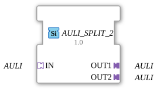

# AULI_SPLIT_2

* * * * * * * * * *

## Introduction

The function block **AULI_SPLIT_2** is used to distribute an incoming AULI adapter (unidirectional) to two identical outputs. It is implemented as a generic function block and enables simple signal multiplication in IEC 61499-based systems.

## Interface Structure

### **Event Inputs**

None.

### **Event Outputs**

None.

### **Data Inputs**

None.

### **Data Outputs**

None.

### **Adapter**

| Direction | Name | Type | Description |
| ---------- | ------ | ----- | -------------- |
| **Socket (Input)** | IN | AULI (unidirectional) | Incoming AULI data stream |
| **Plug (Output)** | OUT1 | AULI (unidirectional) | First output, identical copy of IN |
| **Plug (Output)** | OUT2 | AULI (unidirectional) | Second output, identical copy of IN |

## Functionality

The module forwards the AULI data received via the **IN** socket unchanged to both outputs, **OUT1** and **OUT2**. No data manipulation, buffering, or protocol conversion takes place. The distribution is passive and instantaneous.

## Technical Features

- **Generic Type**: The function block is declared as `'GEN_AULI_SPLIT'` via the attribute `eclipse4diac::core::GenericClassName`, enabling flexible reuse in various engineering environments.
- **No State Management**: The function block has no internal state machine (ECC) and no memory behavior. It is completely passive.
- **Pure Adapter Interface**: Only adapters (`Plugs` and `Sockets`) are used; there are no data or event inputs.

## State Overview

Since the function block contains no internal logic or state machine, there is no state description. Its behavior is limited to the constant forwarding of the incoming signal.

## Application Scenarios

- **Signal Distribution**: Splitting an AULI data stream to two subsequent function blocks, e.g., for parallel processing or control.
- **Redundant Transmission**: Providing a second, identical data path for monitoring or security purposes.
- **Point-to-Multipoint Communication**: Enabling simple 1-to-2 wiring in adapter-based architectures.

## Comparison with Similar Components

| Component | Function |
| ---------- | ---------- |
| **AULI_SPLIT_2** | Split to two outputs (identical to IN) |
| **AULI_SPLIT_N** | Generalized variant with a configurable number of outputs |
| **AULI_MERGE** | Merging multiple inputs into one output |

While **AULI_SPLIT_2** performs a fixed 1:2 split, generic splitters allow for a flexible number of outputs. Mergers like **AULI_MERGE** accomplish the opposite.

## Change Detection

Each output plug is updated independently: the incoming value is written to a given output, and its adapter event sent, only if it differs from that output's current value. Outputs that are already in sync stay quiet, while an output that was just connected (or has drifted out of sync) still receives the update it needs.

## Conclusion

The **AULI_SPLIT_2** is a minimal and efficient component for multiplying signals from unidirectional AULI adapters. Due to its passive, stateless nature, it is ideally suited for real-time applications where copies of a data stream are needed without additional latency or logic. Its generic implementation facilitates its use in various development tools and libraries.

---

### 🌐 Related topic subpages on ms-muc-docs.de

- [🌐 Eclipse 4diac IDE & color reference on ms-muc-docs.de](https://www.ms-muc-docs.de/iec-61499/eclipse-4diac/)

]
