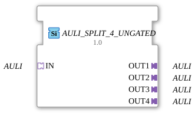

# AULI_SPLIT_4_UNGATED

> ℹ️ **UNGATED variant:** This block is the ungated version of [`AULI_SPLIT_4`](AULI_SPLIT_4.md). It suppresses **no** unchanged repeats – every newly computed result is forwarded unconditionally, even without a value change. This matters for consumers that need a periodic cadence regardless of value change (e.g. derivative/frequency calculations that would otherwise fail to decay toward zero). Any change-detection/gating statements further down this page do **not** apply to this block.

* * * * * * * * * *

## Introduction

The function block **AULI_SPLIT_4_UNGATED** is used to split an incoming **AULI** adapter into four separate, identical outputs. It is designed as a generic function block (Generic FB) and is distributed under the Eclipse Public License 2.0. It was developed for use in automation technology, particularly within the HR Agrartechnik GmbH environment.

## Interface Structure

### **Event Inputs**

No event inputs available.

### **Event Outputs**

No event outputs available.

### **Data Inputs**

No data inputs available.

### **Data Outputs**

No data outputs available.

### **Adapter**

| Type | Name | Direction | Description |
| ----- | ------ | ---------- | -------------- |
| `adapter::types::unidirectional::AULI` | `IN` | Socket | Input adapter for the AULI signal to be distributed |
| `adapter::types::unidirectional::AULI` | `OUT1` | Plug | First output adapter (identical to the input) |
| `adapter::types::unidirectional::AULI` | `OUT2` | Plug | Second output adapter |
| `adapter::types::unidirectional::AULI` | `OUT3` | Plug | Third output adapter |
| `adapter::types::unidirectional::AULI` | `OUT4` | Plug | Fourth Output Adapter |

## Functionality

This function block operates as a passive distribution structure. The AULI adapter connected to `IN` is internally routed to the four outputs `OUT1` to `OUT4`. Since no active logic, processing, or buffering takes place, the data present at the input (e.g., signals, values, states) is passed on unchanged to all four outputs. The connection is unidirectional – changes to the outputs do not affect the input.

## Technical Features

- **Generic Function Block**: The function block is declared as a generic function block with the generic class name `GEN_AULI_SPLIT`. This allows for flexible adaptation and reuse in various contexts (e.g., through parameterization during instantiation).
- **Unidirectional Adapters**: All adapters used are of type `adapter::types::unidirectional::AULI`, meaning they only support data flow in one direction.
- **License**: The block is licensed under the Eclipse Public License 2.0 and may be used and modified in accordance with the terms of this license.
- **No Own Events or Data**: All functionality is implemented exclusively via adapters. This reduces overhead and simplifies integration into existing 4diac architectures.

## State Overview

The block does not have its own state machine (no ECC states). It behaves stateless: The outputs always reflect the current state of the input. Initialization or special state transitions are not required.

## Application Scenarios

- **Signal Distribution**: An AULI-based signal (e.g., control command, measured value) is to be forwarded to multiple consumers or downstream function blocks.
- **Redundancy or Parallel Processing**: Several independent instances of a component require the same input value – the split enables simple distribution without additional logic.
- **Test and Simulation Environments**: In test setups, an AULI signal can be distributed to multiple observers or loggers.

## Comparison with Similar Function Blocks

The **AULI_SPLIT_4_UNGATED** is a specialized split function block exclusively for the unidirectional AULI adapter type. Unlike general split function blocks (e.g., `SPLIT` for various data types), it is fixed to exactly one adapter interface, which increases type clarity and prevents misconfigurations. It differs from active distributors (e.g., `MUX` or `DEMUX`) in its passive, lossless distribution without switching logic or addressing.

## Change Detection

This block performs **no** change detection. Every newly computed result is written to the output and its adapter event fired unconditionally, regardless of whether the value differs from the previous run.

## Conclusion

The **AULI_SPLIT_4_UNGATED** is a simple yet useful function block for multiplying an AULI adapter to four outputs. Its generic design and the absence of unnecessary logic allow it to integrate seamlessly into modular 4diac projects. It is particularly suitable for applications where a signal needs to be passed on to multiple receivers without requiring further processing or selection.

---

### 🌐 Related topic subpages on ms-muc-docs.de

- [🌐 Eclipse 4diac IDE & color reference on ms-muc-docs.de ](https://www.ms-muc-docs.de/iec-61499/eclipse-4diac/)
