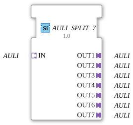

# AULI_SPLIT_7

* * * * * * * * * *
## Introduction
The **AULI_SPLIT_7** function block serves as a generic splitter that distributes an incoming AULI adapter signal (unidirectional) to seven separate AULI outputs. It is specifically designed for splitting a command or data stream (AULI protocol) and allows multiple downstream components to be supplied with the same signal simultaneously.
## Interface Structure

### **Event Inputs**

No event inputs available.

### **Event Outputs**

No event outputs available.

### **Data Inputs**

No data inputs available.

### **Data Outputs**

No data outputs available.

### **Adapter**

| Direction | Name | Type | Description |

|----------|------|-----|--------------|

Socket (Input) | IN | `adapter::types::unidirectional::AULI` | Receives the AULI signal to be split |

Plug (Output) | OUT1 | `adapter::types::unidirectional::AULI` | First output for the AULI signal |

Plug (Output) | OUT2 | `adapter::types::unidirectional::AULI` | Second output |

Plug (Output) | OUT3 | `adapter::types::unidirectional::AULI` | Third output |

Plug (Output) | OUT4 | `adapter::types::unidirectional::AULI` | Fourth output |

Plug (Output) | OUT5 | `adapter::types::unidirectional::AULI` | Fifth Output |

| Plug (Output) | OUT6 | `adapter::types::unidirectional::AULI` | Sixth Output |

| Plug (Output) | OUT7 | `adapter::types::unidirectional::AULI` | Seventh Output |

## Functionality

This module forwards the AULI signal present at socket **IN** unchanged to all seven plugs **OUT1** through **OUT7**. No signal processing, filtering, or delay takes place. Each output receives the same signal sequence simultaneously as the input. The distribution is handled purely by the circuitry and signal processing within the 4diac IDE; no calculations or state changes are required.

``` ## Technical Features

- **Generic Function Block:** The function block is declared as a generic type (`GEN_AULI_SPLIT`) and uses the attribute `eclipse4diac::core::GenericClassName` for type-safe adapter assignment.
- **Unidirectional Adapter:** Both input and output are based on the adapter type `adapter::types::unidirectional::AULI`, which supports only one direction of data flow.
- **No Event Control:** The function block does not require trigger events; signal propagation occurs automatically when the input signal changes.
- **No Internal States:** There is no state machine or memory behavior – the function block is purely combinational.

## State Overview

Since there is no state machine (ECC), the function block has no internal states. The output signal follows the input signal immediately without delay or logic.

## Application Scenarios
- **Parallel Supply of Multiple Actuators**: A common control signal (e.g., via an AULI adapter) is to be distributed simultaneously to multiple actuators or subsystems.
- **Signal Multicasting**: Distribution of a sensor signal or configuration message to multiple receivers in the automation system.
- **Test and Simulation Setups**: Splitting an input signal for simultaneous monitoring at different measuring points.

## Comparison with Similar Function Blocks

The 4diac library contains splitter blocks for various output numbers, e.g., `AULI_SPLIT_3` or `AULI_SPLIT_5`. The `AULI_SPLIT_7` differs only in the number of outputs (7). Function blocks for splitting other adapter types (e.g., `BOOL_SPLIT`, `INT_SPLIT`) have similar logic but work with different data and adapter formats.

## Conclusion

The `AULI_SPLIT_7` is a simple yet essential function block for signal distribution within the AULI adapter landscape. It allows for the clean and type-safe splitting of a unidirectional signal across up to seven paths without additional logic or delays. Thanks to its generic design, it can be flexibly used in IEC 61499-based automation projects.

---

### 🌐 Related topic subpages on ms-muc-docs.de
* [🌐 Eclipse 4diac IDE & color reference on ms-muc-docs.de ](https://www.ms-muc-docs.de/iec-61499/eclipse-4diac/)

]