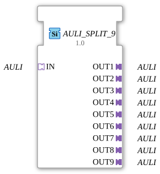

# AULI_SPLIT_9

* * * * * * * * * *
## Introduction

The function block **AULI_SPLIT_9** serves as a distributor for the unidirectional AULI adapter. It receives an incoming AULI data set via the **IN** socket and forwards it unchanged to all nine output adapters (**OUT1** to **OUT9**). The block is designed as a generic splitter and is suitable for applications where an AULI signal needs to be split among multiple devices.
## Interface Structure

### Event Inputs

No event inputs available.

The forwarding is purely data-driven.

### Event Outputs

No event outputs available.

The block does not generate any control events.

### Data Inputs

No data inputs available.

All data exchange occurs via the **IN** adapter.

### Data Outputs

No data outputs are available.

Data output occurs exclusively via the **OUT1** to **OUT9** adapters.

### Adapters

| Type | Direction | Name | Description |
|-----|----------|------|--------------|
| Socket | Input | **IN** | Unidirectional AULI adapter – receives the data set to be distributed. |
| Plug | Output | **OUT1** … **OUT9** | Nine unidirectional AULI adapters – output the identical input data set. |

## Functionality

The module operates as a pure 1:9 distribution stage. As soon as a data set is present at the **IN** socket, this data set is copied unchanged to all nine plugs **OUT1** to **OUT9**. Since there are no event-driven activations or processing steps, the pass-through occurs implicitly through the runtime environment as soon as the input data record changes. The function block has no internal logic or state memory.

## Technical Features

- **Generic Structure**: The function block is registered under the generic class name `GEN_AULI_SPLIT` and can be adapted depending on the runtime environment configuration.
- **Unidirectional Data Flow**: All involved adapters are of type `adapter::types::unidirectional::AULI`, which defines a clear data flow direction – from the socket IN to the plugs. No feedback is intended.
- **No State Maintenance**: The function block is stateless and requires no initialization or special control.

## State Overview

The function block does not have an explicit state machine. It is always in active pass-through mode. The only "state" is the identity of the input data record being passed through.

## Application Scenarios

- **Multiplication of a control/measurement signal** in automation technology, e.g., in agricultural or farm engineering (the origin of the function block indicates corresponding environments).
- **Division of an AULI-based protocol channel** across multiple parallel receivers without requiring active copying or signal amplification.
- **Simple star distribution** within a 4diac application when multiple subsequent function blocks require the same AULI data set.

## Comparison with Similar Function Blocks

- **AULI_SPLIT_4 / AULI_SPLIT_8**: These variants differ only in the number of output channels. The function block described here offers a particularly high distribution density with 9 outputs.
- **Generic splitter function blocks for other adapter types**: In principle, analog splitters exist for... B. `AULI` adapter with a lower output count. All of them share stateless 1:n duplication.

## Conclusion

The **AULI_SPLIT_9** is a simple yet effective distribution block for the unidirectional AULI adapter. Thanks to its generic nature and complete signal passthrough without latency or processing delay, it is ideally suited for scenarios where a single data set needs to be distributed to many receivers. The lack of event control and the pure adapter approach make it particularly lightweight and performant.

--

### 🌐 Related topic subpages on ms-muc-docs.de

* [🌐 Eclipse 4diac IDE & color reference on ms-muc-docs.de](https://www.ms-muc-docs.de/iec-61499/eclipse-4diac/)
