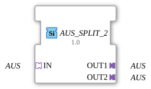

# OFF_SPLIT_2



* * * * * * * * * *
## Introduction
The function block **OFF_SPLIT_2** is used to distribute an incoming OFF signal to two identical outputs. It is implemented as a generic function block (FB) and is suitable for applications where a universal control signal is required multiple times. The block operates purely on an adapter basis and has no event or data inputs of its own.

## Interface Structure
### **Event Inputs**
No event inputs available.

### **Event Outputs**
No event outputs available.

### **Data Inputs**
No data inputs available.

### **Data Outputs**
No data outputs available.

### **Adapter**

| Direction | Name | Type | Description |

|----------|------|------------------|----------------------------------------------------|

Sockets | IN | OFF (unidirectional) | Input adapter that receives the signal to be distributed |

Plugs | OUT1 | OFF (unidirectional) | First output adapter, identical to the input signal |

Plugs | OUT2 | OFF (unidirectional) | Second output adapter, identical to the input signal |

## Functionality
The module forwards the OFF signal present at socket **IN** unchanged to both plugs **OUT1** and **OUT2**. No processing or buffering takes place – the distribution is purely topological. The input signal is available at both outputs simultaneously and without delay. The connection is only activated when the socket is connected to a corresponding adapter.


``` ## Technical Features

- **Generic Type**: The function block is declared as `GEN_AUS_SPLIT` with the attribute `eclipse4diac::core::GenericClassName`. This allows it to be reused in different projects without type modification.

- **No State Dependency**: The function block operates statelessly – there is no internal behavior controlled by a state machine.

- **Adapter-Based**: All interfaces are implemented as adapters of type `adapter::types::unidirectional::AUS`. This enables flexible cabling in directional communication.

- **Copyright**: The function block originates from HR Agrartechnik GmbH and is subject to the Eclipse Public License 2.0.

## State Overview
Since the function block has no state logic, there is no state machine. Its functionality is limited to simple signal transmission.


## Application Scenarios

- **Signal Distribution in Control Engineering**: When a bus signal or a universal control signal needs to be distributed to multiple parallel modules.

- **Test and Simulation Setups**: To split a single test signal across two parallel paths.

- **Redundant Connection**: When a signal needs to be sent to two independent receivers for availability reasons.

## Comparison with Similar Components

- **OFF_SPLIT_3 / OFF_SPLIT_N**: Analog components with three or more outputs. `AUS_SPLIT_2` is the simplest option for splitting a signal across two channels.

- **Event-Based Splitters**: Unlike components with event inputs (e.g., `E_SPLIT`), `AUS_SPLIT_2` operates exclusively via adapters and is therefore suitable for pure signal distribution without control logic.

- **Merge Blocks**: While splitters duplicate signals, merge blocks combine multiple signals into one (e.g., `AUS_MERGE_2`).

## Conclusion
The `AUS_SPLIT_2` is a minimalist yet useful function block for decentralized signal distribution in 4diac applications. Its generic nature and simple adapter interface make it universally applicable, especially when only unidirectional signal copying is required. More complex tasks involving control or processing logic require extended versions.

--

### 🌐 Related topic subpages on ms-muc-docs.de

* [🌐 Eclipse 4diac IDE & Color Reference on ms-muc-docs.de ](https://www.ms-muc-docs.de/iec-61499/eclipse-4diac/)

]