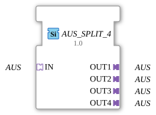

# OFF_SPLIT_4

* * * * * * * * * *
## Introduction
The function block `AUS_SPLIT_4` distributes an incoming **OFF** signal (typically a binary control signal for "Off") to four identical output signals. It serves as a generic splitter and allows a single command or state to be forwarded to multiple downstream components without requiring separate branching logic.
## Interface Structure

### **Event Inputs**

None.

### **Event Outputs**

None.

### **Data Inputs**

None.

### **Data Outputs**

None.

### **Adapters**

The function block communicates exclusively via adapters of type `adapter::types::unidirectional::AUS`. This is a unidirectional adapter that transmits a Boolean signal (OFF command).

| Direction | Name | Type | Description |

|----------|------|-----|--------------|

| **Socket (Input)** | `IN` | `adapter::types::unidirectional::AUS` | Receives the original OFF signal. |

| **Plug (Output)** | `OUT1` | `adapter::types::unidirectional::AUS` | First outgoing OFF path. |

| **Plug (Output)** | `OUT2` | `adapter::types::unidirectional::AUS` | Second outgoing OFF path. |

| **Plug (Output)** | `OUT3` | `adapter::types::unidirectional::AUS` | Third outgoing OFF path. |

| **Plug (Output)** | `OUT4` | `adapter::types::unidirectional::AUS` | Fourth outgoing OFF path. |

## Functionality

The module operates as a pure signal distributor: As soon as an OFF signal is present at socket `IN`, it is passed on unchanged to all four plugs (`OUT1` to `OUT4`). No logical processing, delay, or state change takes place. The distribution occurs in parallel and immediately.

## Functionality The generic nature of the function block (recognizable by the attribute `GenericClassName = 'GEN_AUS_SPLIT'`) allows for reuse in various applications that use the same OFF signal type.

## Technical Features
- **License**: The source code is subject to the **Eclipse Public License 2.0** (EPL-2.0).
- **Author**: Developed by **HR Agrartechnik GmbH**, Version 1.0, January 24, 2025.
- **Generic Implementation**: The function block is declared as a generic FB (`GenericClassName` = `'GEN_AUS_SPLIT'`), which allows for easy adaptation to different signal types or configurations.
- **Adapter-Based**: Communication takes place exclusively via adapters, not via traditional event or data ports. This allows the function block to be seamlessly integrated into an adapter-based architecture.
- **No State Machine**: There is no internal state logic – the distribution is purely combinatorial.

## State Overview

The module does not have a state machine. The output signals follow the input signal directly. Therefore, a graphical state overview is not available.

## Application Scenarios
- **Feedback of OFF Signals**: A central "off" command from a controller should simultaneously switch off multiple actuators or subsystems.
- **Redundant Monitoring**: Distributing an OFF signal to multiple monitoring units that must react to the command independently.
- **Modular Machine Structure**: In a modular system, an OFF signal, once detected, is routed to multiple modules via buses or coupling elements. `AUS_SPLIT_4` replaces complex wiring or logical OR operations.
- **Testing and Simulation**: For simultaneously controlling multiple simulated components with the same signal.

## Comparison with Similar Function Blocks

| Function Block | Function | Special Feature |

|----------|----------|--------------|

| `AUS_SPLIT_2` | Distributes an OFF signal to two outputs | Fewer ports, more compact. |

| `AUS_SPLIT_4` | Distributes to four outputs | This function block. |

| `AUS_SPLIT_N` | Configurable splitter (e.g., via generic adapter lists) | More flexible number, but more complex to configure. |

| `AUS_MERGE` | Combines multiple OFF inputs into one output | Counterpart to the splitter. |

The `AUS_SPLIT_4` sits between a simple 2-way splitter and a fully configurable splitter. It is ideal when exactly four outputs are needed – without any additional configuration.

## Conclusion

The `AUS_SPLIT_4` is a simple yet useful generic function block for distributing an OFF signal to four parallel paths. Its adapter-based interface and clear separation of logic and signal transmission make it a robust component in IEC 61499-based automation. Thanks to its generic declaration, it can be easily integrated into various projects and, if necessary, adapted to custom signal types.
