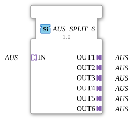

# OFF_SPLIT_6

* * * * * * * * * *

## Introduction

The function block **OFF_SPLIT_6** is a generic block that distributes an incoming OFF signal (e.g., a uniform control signal or event) to six identical outputs. It serves as a splitter in IEC 61499 communication via adapters and enables simple multiple use of a signal without additional logic.

## Interface Structure

### **Event Inputs**

- No independent event inputs are available. All communication takes place via the integrated adapter socket.

### **Event Outputs**

- No independent event outputs are available. Outputs are provided exclusively via the adapter plugs.

### **Data Inputs**

- No direct data inputs. Data transfer is implemented indirectly via the adapter socket.

### **Data Outputs**

- No direct data outputs. The output data is provided via the adapter plugs.

### **Adapters**

| Type | Name | Direction | Description |
| ----- | ------ | ---------- | -------------- |
| `adapter::types::unidirectional::AUS` | **IN** | Socket | Incoming output signal distributed to all outputs. |
| `adapter::types::unidirectional::AUS` | **OUT1** | Plug | First output – identical to **IN**. |
| `adapter::types::unidirectional::AUS` | **OUT2** | Plug | Second output – identical to **IN**. |
| `adapter::types::unidirectional::AUS` | **OUT3** | Plug | Third output – identical to **IN**. |
| `adapter::types::unidirectional::AUS` | **OUT4** | Plug | Fourth output – identical to **IN**. |
| `adapter::types::unidirectional::AUS** | **OUT5** | Plug | Fifth output – identical to **IN**. |
| `adapter::types::unidirectional::AUS` | **OUT6** | Plug | Sixth output – identical to **IN**. |

*Note: The adapter type "AUS" is a unidirectional adapter that transmits a signal (event + data, if applicable) in one direction.*

## Functionality

The module functions as a passive distributor. The signal present at socket **IN** is copied unchanged and without delay to all six plugs **OUT1** to **OUT6**. No filtering, transformation, or buffering takes place. The function block behaves like a "fan-out" node for AUS adapter connections.

## Technical Features

- **Generic Type**: The function block is implemented as a generic function block (GenericClassName = `'GEN_AUS_SPLIT'`). In the 4diac IDE, it can be instantiated depending on the specific AUS adapter type.
- **Dependencies**: Requires the adapter `adapter::types::unidirectional::AUS` from the package `adaper::events::unidirectional`. The implementation imports the Eclipse 4diac base types `GenericClassName` and `TypeHash`.
- **No State**: The function block does not have an internal state machine (no ECC). It operates purely combinatorially – any change at the input is immediately passed through to all outputs.
- **Unidirectional**: The adapters are designed for signal flow in only one direction. Feedback from the outputs to the input is not possible.

## State Overview

The module has **no explicit states**. Its behavior is determined solely by the current configuration of the input adapter. State changes in the sense of an automaton do not occur.

## Application Scenarios

- **Distributing an "OFF" Control Signal**: In a system, a single stop or shutdown signal is to be simultaneously forwarded to multiple actuators (motors, valves, etc.).
- **Redundant Signal Paths**: A signal is split across multiple parallel paths to trigger different actions in subsequent processing steps.
- **Test and Simulation Environments**: A generated test signal is sent unchanged to various monitoring or logic modules.

## Comparison with Similar Function Blocks

- **Event Splitter (e.g., `E_SPLIT`)**: Processes discrete events at its own input/output events. In contrast, `AUS_SPLIT_6` operates at the adapter level and distributes both the event and its associated data in one step.
- **Data Splitter**: Pure data distributors (e.g., `F_MUX`, `F_DIST`) require separate data types. The present function block is specific to the adapter type `AUS` and encapsulates the signal structure.
- **Generic Capability**: Thanks to its generic declaration, the function block can be reused in various contexts with different output adapter implementations.

## Change Detection

Each output plug is updated independently: the incoming value is written to a given output, and its adapter event sent, only if it differs from that output's current value. Outputs that are already in sync stay quiet, while an output that was just connected (or has drifted out of sync) still receives the update it needs.

## Conclusion

The **OFF_SPLIT_6** is a simple yet useful generic function block for signal distribution in IEC 61499 applications. It reduces wiring complexity by converting a single OFF signal to six parallel outputs. Its generic nature makes it versatile, as long as the OFF adapter used adheres to the unidirectional contract.

---

### 🌐 Related topic subpages on ms-muc-docs.de

- [🌐 Eclipse 4diac IDE & color reference on ms-muc-docs.de](https://www.ms-muc-docs.de/iec-61499/eclipse-4diac/)

]
