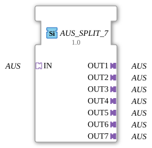

# OFF_SPLIT_7

*(No image available)*

* * * * * * * * * *
## Introduction
The function block **OFF_SPLIT_7** is a generic block for distributing a single OFF adapter signal to seven identical OFF outputs. It serves as a signal multiplier in control applications based on the IEC 61499 standard. The block has no event- or data-based interfaces, but communicates exclusively via adapters of type `adapter::types::unidirectional::AUS`. The actual signal type is only determined at runtime via the generic attribute `GenericClassName`.
## Interface Structure
### **Event Inputs**
None available.

### **Event Outputs**
None available.

### **Data Inputs**
None available.

### **Data Outputs**
None available.

### **Adapter**

| Direction | Name | Type | Description |
|----------|------|-----|--------------|
| **Socket** (Input) | `IN` | `adapter::types::unidirectional::AUS` | Uniform OFF input signal |
| **Plug** (Output) | `OUT1` – `OUT7` | `adapter::types::unidirectional::AUS` | Seven parallel OFF signals |

## Functionality
The module receives an OFF signal via the adapter socket `IN`. This signal is passed on unchanged and without delay to all seven adapter plugs `OUT1` to `OUT7`. Since the function block is declared as a generic function block (`GenericClassName = 'GEN_AUS_SPLIT'`), the specific type of the OFF adapter can be overridden at design time or during system configuration. The behavior always remains the same: a one-to-many distribution.

## Technical Features
- **Generic Function Block**: The actual adapter type is defined via the attribute `eclipse4diac::core::GenericClassName`. By default, `'GEN_AUS_SPLIT'` is set.
- **No ECC / State Machine**: Due to the absence of event inputs, the function block does not have an internal state machine. The outputs follow the input signal directly (combinatory behavior).
- **Pure Adapter Communication**: No IEC 61499 data types (BOOL, INT, etc.) are used; all data transmission occurs via unidirectional OFF adapters.
- **Compatibility**: The function block is designed for use in 4diac IDE and runtime environments that support adapters of type `adapter::types::unidirectional::AUS`.

## State Overview
The function block does not have a state machine. The output signal of each of the seven OUT adapters always corresponds to the current value of the IN adapter. There is no time delay or state storage.

## Application Scenarios
- **Signal Distribution in Redundant Systems**: A central OFF control signal (e.g., "emergency stop") is to be forwarded to several decentralized actuators or subsystems.
- **Modular Automation Structures**: An OFF signal received from a higher-level controller is split into seven parallel paths that control independent machine modules.
- **Test and Simulation Environments**: For easily replicating a test signal without changing the logic.

## Comparison with Similar Function Blocks
- **AUS_SPLIT_N** (e.g., for 2, 4, or 8 outputs) exist in variants with different numbers of outputs. AUS_SPLIT_7 is a specific variant for exactly seven outputs.
- Unlike data splitters (e.g., `SPLIT_INT`, `SPLIT_BOOL`), this function block works exclusively with adapters and not with elementary data types. This makes it particularly suitable for protocol-based or type-safe connections.
- Function blocks with event interfaces (e.g., `E_SPLIT`) distribute events, not signals. AUS_SPLIT_7, on the other hand, distributes a continuous signal value.

## Conclusion

The **AUS_SPLIT_7** is a simple yet effective generic function block for the unidirectional distribution of an OFF adapter signal to seven parallel outputs. Its purely adapter-based interface and lack of event logic make it suitable for all applications where a signal needs to be duplicated without delay or state storage. It offers a clean, modular solution for signal distribution in IEC 61499-based automation systems.

---

### 🌐 Related topic subpages on ms-muc-docs.de
* [🌐 Eclipse 4diac IDE & color reference on ms-muc-docs.de](https://www.ms-muc-docs.de/iec-61499/eclipse-4diac/)

]
